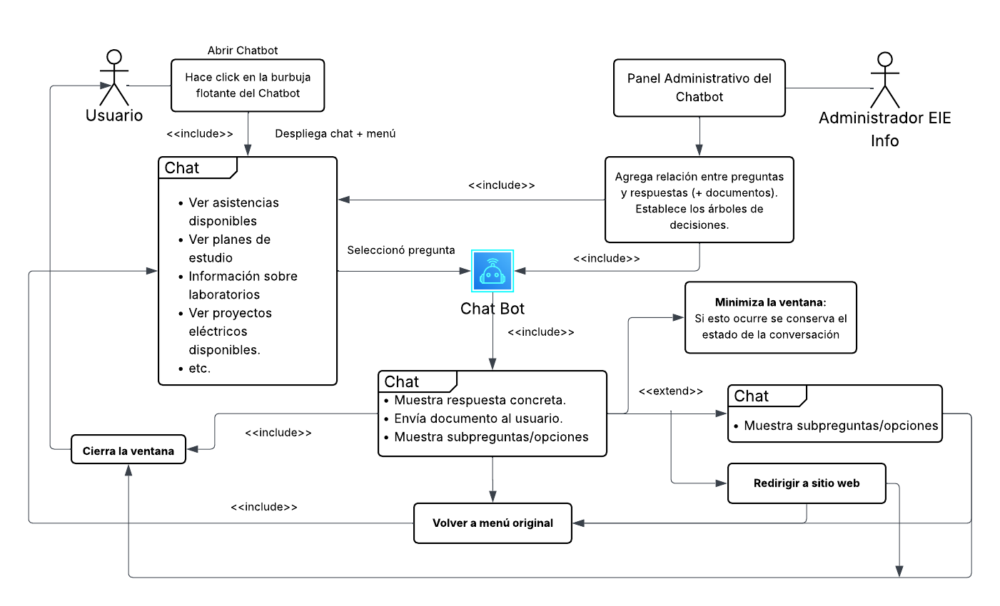
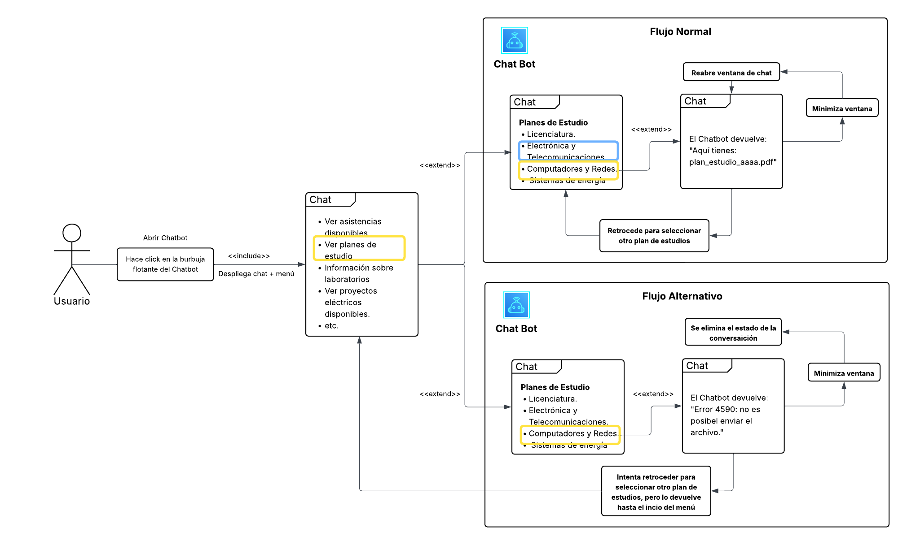
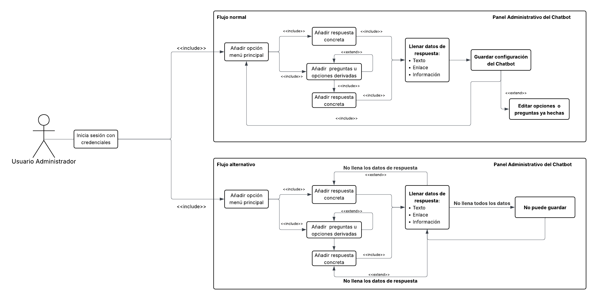
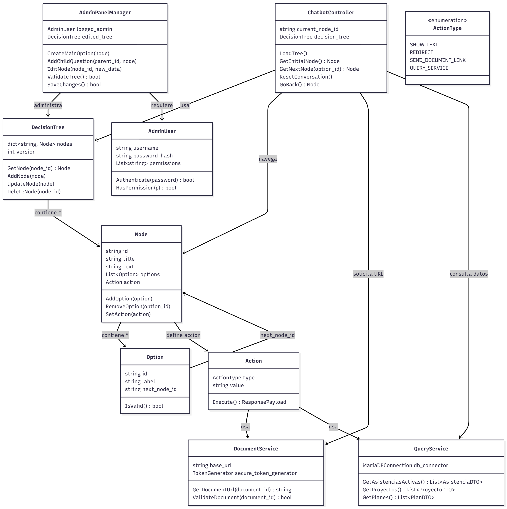
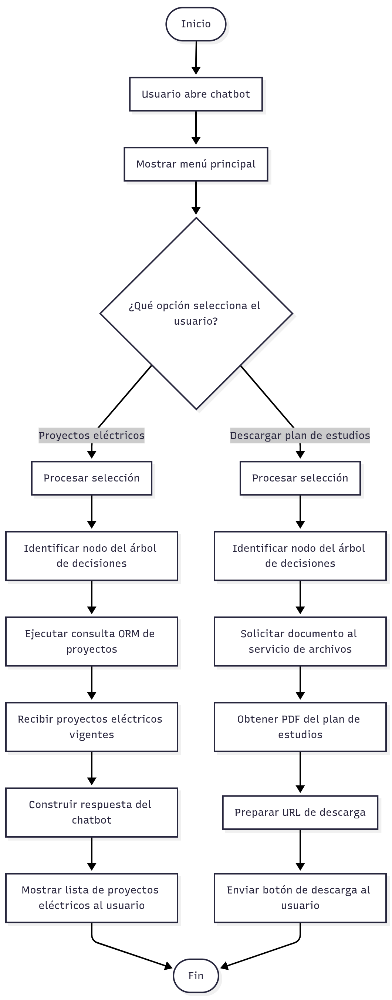
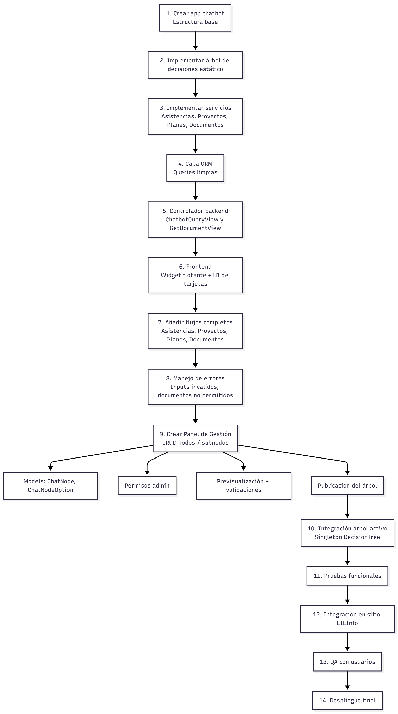

# Chatbot Basado en Flujos de Decisión para el Soporte Informativo en EIE Info

### Semana 2 – Requerimientos, rediseño y modelado UML del módulo a mejorar
*II-2025*

Estudiantes: 
- Josué María Jiménez Ramírez, C13987
- Santiago Herra Castro, C13721

## 1. Selección formal del módulo o mejora

### 1.1. Descripción del problema actual basada en Semana 1
El sistema EIEInfo centraliza gran parte de la información académica y administrativa de la Escuela de Ingeniería Eléctrica. Sin embargo, esta información no es de acceso inmediato para los usuarios, ya que se encuentra distribuida dentro de secciones que requieren autenticación y navegación interna. Para consultar datos generales, el usuario debe crear una cuenta o iniciar sesión, identificar correctamente en qué sección se encuentra la información y desplazarse por múltiples menús.

Este diseño dificulta el acceso rápido a contenido relevante como planes de estudio, trámites de graduación, información de prácticas, proyectos eléctricos, asistencias disponibles, documentación general de cursos y datos sobre servicios o laboratorios. Además, el acceso está restringido a estudiantes con credenciales activas, excluyendo al público general, personas interesadas en la carrera y egresados sin cuenta vigente.

Como resultado, el sistema no es intuitivo para nuevos usuarios y aumenta la carga cognitiva incluso para estudiantes regulares, quienes deben invertir más tiempo del necesario en localizar información puntual.

### 1.2. Justificación técnica y funcional (¿por qué es necesario?)
La mejora propuesta consiste en la implementación de un chatbot basado en flujos de decisión que permita acceder de forma inmediata a la información general disponible en EIEInfo sin requerir autenticación ni navegación compleja. Esta solución es técnicamente necesaria porque reduce la dependencia de la estructura interna del sistema, disminuye los pasos necesarios para encontrar información y evita operaciones de consulta repetitivas dentro de la interfaz actual.

Desde un punto de vista funcional, el chatbot actúa como un intermediario que centraliza la información pública, guiando al usuario mediante un árbol de decisiones y permitiendo consultas directas respaldadas por ORM cuando corresponda. La herramienta ofrece una interacción más fluida mediante respuestas rápidas, accesos directos y entrega de documentos mediante enlaces, sin comprometer datos privados o internos. Esto se alinea con las políticas de seguridad del sitio, ya que únicamente se expone información pública o no sensible.

### 1.3. Impacto esperado
La incorporación del chatbot se espera que mejore significativamente la accesibilidad y experiencia general de los usuarios al interactuar con EIEInfo. El impacto principal incluye la reducción del tiempo de búsqueda, la eliminación de la necesidad de autenticación para información pública y la disminución de la complejidad asociada a la navegación interna del sistema.

Se anticipa un beneficio directo para estudiantes de primer ingreso, público externo, personas interesadas en la carrera y egresados que ya no poseen credenciales activas. También se facilita el trabajo de estudiantes regulares, quienes podrán obtener información puntual sin recorrer múltiples menús.

A nivel institucional, la solución contribuirá a una percepción más moderna y eficiente del portal informativo, promoverá la consulta autónoma de los usuarios y disminuirá la carga de solicitudes directas al personal administrativo.

## 2. Definición exhaustiva de requerimientos

### 2.1. Requerimientos Funcionales <!-- Josué (min 8)-->
- El sistema deberá permitir mostrar un ícono flotante de chatbot en la esquina inferior derecha en todas las páginas del sitio EIE Info.
  
- El sistema deberá permitir que el usuario abra el panel del chatbot al hacer clic sobre el ícono flotante.

- El sistema deberá permitir mostrar un menú de opciones o preguntas frecuentes predefinidas, accesibles mediante botones interactivos. Algunas de las opciones predefinidas son: 

    - Ver planes de estudio. 
    - Ver asistencias disponibles. 
    - Ver proyectos eléctricos disponibles. 
    - Información sobre la práctica laboral. 
    - Información sobre trámites de graduación. 
    - Información sobre laboratorios. 

- El sistema deberá permitir que el usuario navegue entre distintas opciones organizadas en un árbol de decisiones, incluyendo submenús y preguntas derivadas.

- El sistema deberá permitir que el usuario reciba respuestas previamente configuradas en función de las opciones que seleccione.

- El sistema deberá permitir al usuario regresar al menú anterior o volver al menú principal desde cualquier punto del flujo.

- El sistema deberá permitir configurar y actualizar el contenido del chatbot (preguntas, respuestas y menús) mediante un panel administrativo o archivo de configuración.

- El sistema deberá permitir redireccionar al usuario a páginas específicas del sitio web cuando una opción del chatbot lo requiera (por ejemplo, a la página de admisión, cursos o contacto).

- El sistema deberá permitir solictudes de documentos de parte del usuario. El chatbot deberá entregar dicho documento. Ejemplo: plan de estudios de licenciatura. 

- El sistema deberá permitir cerrar el panel del chatbot y volver al estado de ícono flotante en cualquier momento, sin perder la integridad del flujo.

### 2.2. Requerimientos No Funcionales

- Seguridad: El chatbot no deberá desplegar información privada o sensible de funcionarios, estudiantes, profesores o administrativos. El sistema deberá anonimizar datos personales y restringir respuestas que incluyan teléfonos, extensión de oficina o información interna que no sea pública según las políticas de la Escuela de Ingeniería Eléctrica.

- Rendimiento: El sistema deberá ser capaz de atender un mínimo de 1750 consultas anuales, considerando que en promedio cada interacción requiere aproximadamente 5 solicitudes al servidor. El chatbot deberá garantizar un rendimiento sostenido para 1750 usuarios anuales actuales gracias que en promedio los estudiantes duran 7 annos en graduarse entonces si en promedio entran 250 personas por anno entonces se mantienen 1750 personas que necesitaran el servicio como minimo.

- Escalabilidad: El chatbot deberá permitir aumentar la capacidad de procesamiento de solicitudes sin requerir reestructuración completa. El sistema deberá admitir configuraciones para incrementar el límite de interacción si la demanda supera las 1750 consultas anuales o si el número de solicitudes por interacción aumenta más allá del promedio.

- Disponibilidad: El chatbot deberá estar disponible en todas las páginas del sitio web EIEInfo al menos el 99% por ciento del tiempo, asegurando que el ícono flotante y el panel del chatbot se carguen adecuadamente en cualquier sección del portal institucional.

- Usabilidad: La interfaz del chatbot deberá ser intuitiva, con tiempos de carga mínimos y flujos de navegación claros. Los botones, menús y redirecciones deberán ser accesibles tanto en dispositivos móviles como de escritorio, manteniendo consistencia visual con el diseño del sitio EIEInfo.

- Mantenibilidad: El chatbot deberá implementarse de forma modular, de manera que las preguntas, respuestas y menús puedan actualizarse sin modificar la lógica principal. Los cambios de contenido deberán realizarse desde un archivo de configuración estructurado o un panel administrativo dedicado.

- Compatibilidad: El chatbot deberá ser compatible con los navegadores utilizados por la población estudiantil y administrativa, incluyendo Chrome, Firefox, Edge y Safari. El componente deberá funcionar sin requerir extensiones adicionales del lado del usuario.

- Integridad de flujo: El chatbot deberá conservar el estado de la conversación mientras el usuario navega por el sitio, evitando reiniciar el flujo a menos que el usuario decida volver al menú principal o cierre explícitamente el panel.

---

### 2.3. Restricciones del Sistema

- El chatbot deberá implementarse utilizando Django, ya que toda la plataforma EIEInfo se encuentra desarrollada en este framework y debe mantener compatibilidad estructural con los módulos existentes.

- El sistema deberá utilizar MariaDB como gestor de base de datos, debido a que la infraestructura del proyecto EIEInfo está estandarizada sobre esta tecnología.

- El chatbot deberá comunicarse exclusivamente mediante conexiones seguras HTTPS, cumpliendo con los lineamientos de seguridad institucional y evitando la transmisión de datos en texto plano.

## 3. Modelado UML completo 

### 3.1. Casos de uso del módulo <!-- Josué -->

### 3.2. Descripción detallada de 2 casos de uso complejos <!-- Josué -->

#### 3.1.1 Usuario solicita un plan de estudios específico

Se enlistan las siguientes **precondiciones**: 

1. El usuario debe tener acceso al sitio web EIE Info, donde se encuentral el chatbot.

2. El usuario debe haber abierto la ventana del chatbot haciendo clic en la burbuja flotante.

3. El chatbot debe estar cargado y operativo, incluyendo su menú inicial.

4. Debe existir conexión a internet o al backend que sirve la información de los planes de estudio.

5. Los archivos de planes de estudio deben estar disponibles en el servidor para ser enviados.

En el caso de **flujo normal** se enlistan las siguientes **postcondiciones**: 

1. El chatbot muestra correctamente el menú principal y posteriormente el de planes de estudio.

2. El usuario selecciona uno de los planes de estudio y el chatbot envía el archivo PDF correspondiente.

3. La conversación permanece en el estado adecuado para permitir regresar y elegir otro plan.

4. La ventana de chat queda disponible para continuar la interacción o minimizarla.

En el caso de **flujo alternativo** se enlistan las siguientes **postcondiciones**: 

1. Si ocurre un error al enviar el archivo (ej. “Error 4590”), el chatbot notifica el fallo al usuario.

2. El estado de la conversación se reinicia, tal como muestra tu diagrama, devolviendo al usuario al menú principal.

3. No se envía ningún archivo PDF.

4. La ventana de chat queda operativa, pero el usuario debe navegar otra vez desde el inicio del menú.

#### 3.2.1 Un usuario administrador prepara el chatbot mediante el sistema de gestión

Se enlistan las siguientes **precondiciones**: 

1. El Usuario Administrador debe contar con credenciales válidas.

2. El Usuario Administrador debe haber iniciado sesión en el sistema.

3. El Panel Administrativo del Chatbot debe estar disponible y accesible para el usuario.

En el caso de **flujo normal** se enlistan las siguientes **postcondiciones**: 

1. Se añade una nueva opción al menú principal del chatbot.

2. Se registran preguntas u opciones derivadas asociadas a esa opción, en caso de que el administrador las haya añadido.

3. Todas las respuestas concretas asociadas han sido creadas correctamente.

4. Los datos de respuesta (texto, enlace, información) han sido completados en su totalidad para cada respuesta.

5. La configuración final del chatbot queda almacenada en el sistema.

6. (Opcional) El administrador puede editar opciones o preguntas ya creadas, quedando guardados los cambios.

En el caso de **flujo alternativo** se enlistan las siguientes **postcondiciones**: 

1. No se guarda la configuración del chatbot.

2. El sistema detecta que faltan datos en alguna respuesta (texto, enlace o información).

3. La opción del menú puede haber sido creada de manera parcial, pero no queda registrada de forma definitiva.

4. Las preguntas derivadas o respuestas concretas vinculadas no se guardan porque los datos incompletos invalidan el proceso.

5. El administrador permanece en el Panel Administrativo, con la posibilidad de completar o corregir la información para intentar guardar nuevamente.

### 3.3. Diagrama de clases <!-- Josué -->

En el siguiente diagrama se muestras las clases que deben ser creadas, así como sus atributos, métodos y relaciones. 

### 3.4. Diagrama de secuencia <!-- El Santi -->

En el siguiente diagrama se muestran 2 secuencias diferentes, la primera siendo una consulta por las asistencias que estan siendo abiertas a los estudiantes y la última, una consulta por los planes de estudio de la carrera.

### 3.5. Diagrama de actividad <!-- El Santi -->

En el siguiente diagrama se muestran las 2 actividades que se mostraron en el diagrama de secuencia mostrado anteriormente.

### 3.6. Diagrama de base de datos <!-- El Santi -->

No se muestra diagrama de base de datos gracias que el chatbot no modifica/agrega/elimina informacion de la base de datos. La base de datos ya existe en el proyecto y solo se le hacen consultas para el despliegue de la informacion. Tampoco el chatbot genera o guarda informacion del usuario que esta haciendo la consulta.  
 

## 4. Diseño de la solución técnica 

### 4.1. Arquitectura propuesta 

La arquitectura propuesta integra el chatbot directamente dentro del proyecto monolítico EIEInfo, aprovechando el framework Django, el ORM existente y la estructura modular del sistema. El chatbot funcionará como una nueva aplicación interna que seguirá el patrón MTV de Django y se conectará a los modelos de otras aplicaciones únicamente a través de consultas específicas autorizadas. El diseño se centra en un chatbot estático, basado en un árbol de decisiones, que permite redirigir al usuario, mostrar información predefinida y ejecutar consultas limitadas en la base de datos para desplegar datos como asistencias, proyectos eléctricos o planes de estudio.

El sistema se dividirá en cuatro capas principales: presentación, lógica del chatbot, servicios internos y acceso a datos. Cada capa mantiene responsabilidades separadas para mejorar la mantenibilidad y evitar acoplamiento excesivo.

---

#### Capas de la arquitectura

- Capa de presentación.  
  Incluye las plantillas HTML, el ícono flotante, el panel emergente del chatbot y los archivos JavaScript responsables de manejar la interfaz y las interacciones del usuario. Esta capa se alojará en `templates/chatbot/` y `static/chatbot/`. Su función es únicamente mostrar opciones, botones, menús y recibir las selecciones del usuario.

- Capa de lógica del chatbot.  
  Implementada en `chatbot/views.py` y `chatbot/decision_tree.py`. Esta capa controla el flujo del árbol de decisiones. Determina cuál es la siguiente respuesta o menú en función del nodo actual, gestionando el contexto de la conversación sin almacenar información sensible del usuario. También define las reglas para volver al menú principal o regresar un paso atrás.

- Capa de servicios internos.  
  Ubicada en `chatbot/services/`. Se encarga de operaciones auxiliares, como obtener documentos, validar entradas, procesar redirecciones y ejecutar consultas específicas a sistemas internos. Los servicios encapsulan funcionalidades como:
  - Obtener planes de estudio,
  - Obtener asistencias activas,
  - Obtener proyectos eléctricos vigentes,
  - Generar la URL de descarga de un documento.

  Esta capa evita duplicación de código y centraliza la lógica que no pertenece al flujo del chatbot.

- Capa de acceso a datos.  
  Se implementa como módulos especializados dentro de `chatbot/queries/`. Utiliza exclusivamente el ORM de Django y expone funciones seguras para que el chatbot consulte información disponible públicamente. Esta capa protege contra el acceso indebido de datos sensibles o privados.

---

### Componentes principales del módulo chatbot

- Widget flotante.  
  Un componente JavaScript que se mostrará sobre todas las vistas del sitio EIEInfo. Incluye animación básica, detección de clic y apertura del panel de conversación.

- Panel de conversación.  
  Una ventana emergente que contiene los botones del menú principal, submenús, preguntas frecuentes y enlaces a páginas del sitio.

- Árbol de decisiones.  
  Un archivo de configuración estructurado en formato JSON o Python, representando nodos del flujo conversacional. Cada nodo contiene:
  - Título,
  - Texto de respuesta,
  - Botones disponibles,
  - Nodo siguiente,
  - Acción especial (si aplica).

- Controlador de flujo.  
  Un módulo Python que interpreta qué nodo debe mostrarse en función de la selección del usuario.

- Servicios de consulta interna.  
  Módulos que realizan consultas controladas a otras aplicaciones del sistema. Por ejemplo:
  - Consultas de asistencias,
  - Consultas de cursos,
  - Consultas de proyectos eléctricos,
  - Acceso a documentos.

- Endpoint de comunicación.  
  Una vista Django que recibe la solicitud de un paso del chatbot y devuelve una respuesta en formato JSON. Resuelve flujos, nodos y consultas dinámicas según corresponda.

---

### APIs o módulos del sistema que deben integrarse o modificarse

- Se deberá agregar una nueva aplicación Django llamada `chatbot`, registrada en `INSTALLED_APPS`.

- Se deberá modificar `urls.py` global del proyecto para añadir rutas del chatbot, como:
  - `/chatbot/query/` para navegación del flujo,
  - `/chatbot/document/<id>/` para descargas controladas.

- Las apps actuales de EIEInfo no requieren modificaciones directas, pero sí se recomienda crear funciones públicas de lectura en:
  - cursos,
  - asistencias,
  - proyectos,
  - laboratorio,
  - web_page o contenido estático.

- Se recomienda agregar endpoints internos reutilizables dentro de las mismas apps o mover su lógica a `services/` para evitar duplicación de código.

- No es necesario modificar la base de datos ni crear nuevas tablas, ya que el chatbot consume únicamente datos existentes.

---

### 4.2 Patrones de diseño aplicados

- MTV (Model–Template–View) de Django.  
  Es el patrón base del proyecto. Se mantiene para asegurar consistencia con el resto de EIEInfo.

- Patrón Service Layer.  
  Centraliza la lógica repetible de consultas o procesamiento. Evita mezclar consultas con flujo del chatbot y mejora la mantenibilidad.

- Patrón Repository o DAO mínimo mediante el ORM.  
  La capa de consultas del chatbot encapsula los accesos a la base de datos, actuando como un repositorio que expone funciones limpias y seguras.

- Patrón Singleton aplicado al árbol de decisiones.  
  El árbol de decisiones se carga una sola vez en memoria para evitar recompilarlo en cada request. Esto mejora el rendimiento sin complejidad adicional.

- Patrón Observer limitado al frontend.  
  El widget del chatbot escucha eventos de clic, apertura y navegación del usuario. Es una implementación simple basada en eventos del navegador.

- Separación estricta de responsabilidades.  
  El chatbot no accede directamente a modelos externos; en su lugar, usa módulos de consulta y servicios internos para promover bajo acoplamiento.

---

### 4.3. Validaciones a implementar <!-- Josué -->
Para garantizar el funcionamiento correcto del chatbot, así como la seguridad y consistencia del sistema, se deberán implementar las siguientes validaciones:

#### Validaciones en el flujo del chatbot
- Validación de que el nodo solicitado por el usuario exista dentro del árbol de decisiones.
- Validación de que la transición solicitada (botón presionado) sea válida para el nodo actual.
- Verificación de que el chatbot no reciba parámetros inesperados o manipulados en el frontend.
- Validación para evitar loops no intencionados dentro del árbol de decisiones.

#### Validaciones en solicitudes de documentos
- Comprobar que el documento solicitado exista en el servidor.
- Validar que el documento pertenezca al conjunto de archivos públicos permitidos.
- Validar que el usuario no envíe rutas incorrectas o manipuladas (prevención de path traversal).
- Validar que la URL generada corresponda a un recurso público y permitido por las políticas de la Escuela.

#### Validaciones en consultas a datos internos
- Asegurar que cada consulta se limite únicamente a información pública.
- Validar que no se retornen datos sensibles como teléfonos privados, extensiones, información de personal o datos administrativos restringidos.
- Controlar excepciones de conexión o fallos de modelo, devolviendo mensajes seguros para el usuario.
- Verificar que los parámetros utilizados en la consulta sean válidos y del tipo correcto.

#### Validaciones en el frontend
- Validación de que los botones, opciones o rutas sean los definidos en el árbol de decisiones.
- Prevención de envío de inputs manuales arbitrarios mediante deshabilitación de entrada libre en el chatbot.
- Validación de estado para evitar inconsistencias si el usuario navega o recarga la página durante una conversación.

---

### 4.4. Posibles riesgos y mitigación <!-- Josué -->
La implementación del chatbot implica ciertos riesgos técnicos y operativos que deben considerarse. A continuación se enumeran los riesgos principales y sus estrategias de mitigación:

#### Riesgos técnicos
- **Acceso accidental a información privada.**  
  Mitigación: limitar las consultas del chatbot únicamente a funciones de lectura explícitamente marcadas como públicas; revisar manualmente cada endpoint.

- **Fallas en la disponibilidad del chatbot.**  
  Mitigación: uso de un widget ligero, implementación de carga diferida (lazy load) y monitoreo de logs para detectar fallos.

- **Errores en consultas a la base de datos.**  
  Mitigación: manejo de excepciones en la capa de servicios, logs estructurados y respuestas seguras que no revelen detalles técnicos.

- **Rendimiento degradado bajo carga.**  
  Mitigación: cachear el árbol de decisiones como Singleton y optimizar consultas ORM para evitar operaciones innecesarias.

#### Riesgos de seguridad
- **Manipulación de parámetros en solicitudes al backend.**  
  Mitigación: sanitización estricta de entradas, validaciones de nodo y botón, deshabilitar inputs libres.

- **Intentos de obtener archivos no autorizados.**  
  Mitigación: whitelisting de documentos públicos, verificación de rutas, prevención de path traversal.

- **Exposición de endpoints internos.**  
  Mitigación: uso de rutas dedicadas con permisos seguros, restricción de métodos HTTP y respuestas homogéneas sin detalles internos.

#### Riesgos operativos o de uso
- **Confusión del usuario por flujos mal diseñados.**  
  Mitigación: pruebas con estudiantes, revisión de usabilidad y simplificación del árbol de decisiones.

- **Dependencia del chatbot para información que aún no está bien estructurada.**  
  Mitigación: centralizar contenido público en formatos uniformes y revisar periódicamente la actualización del árbol.

- **Contenidos desactualizados.**  
  Mitigación: panel administrativo para actualización rápida, controles de versión y responsables asignados.

---

## 5. Roadmap de implementación

