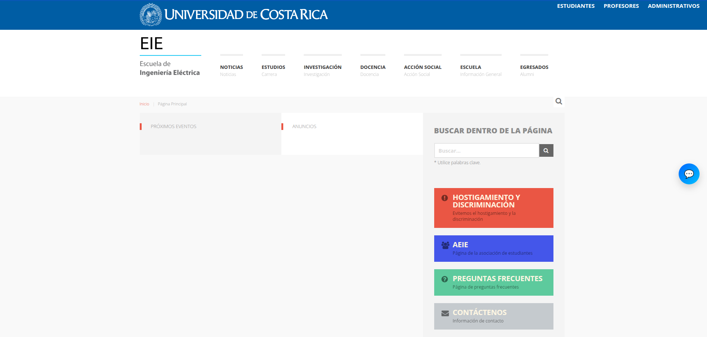
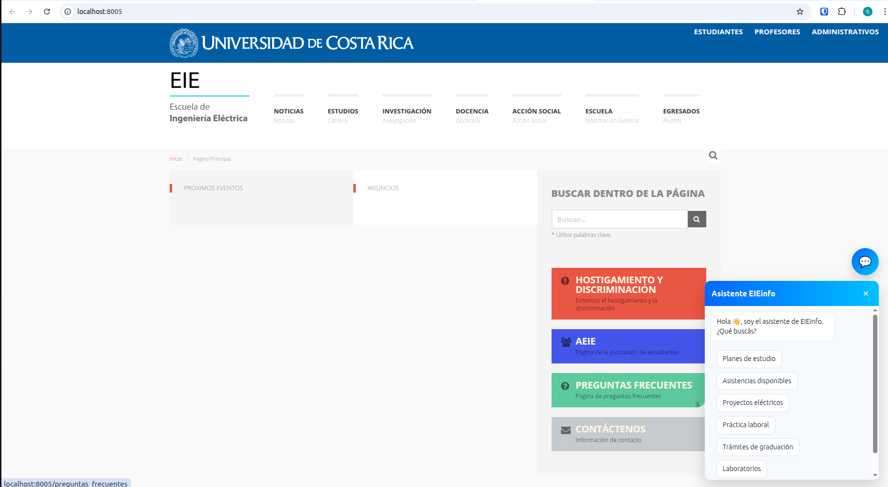
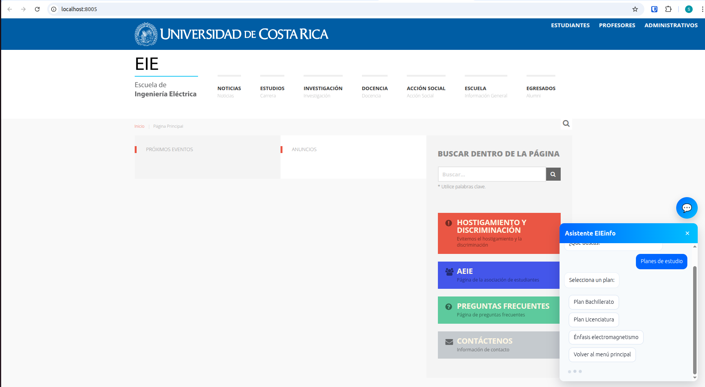
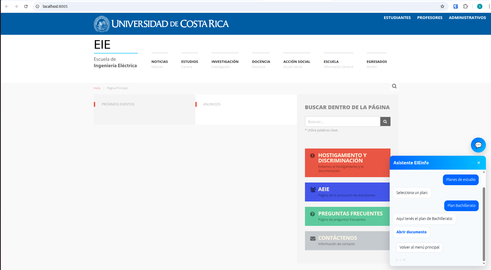

# Chatbot Basado en Flujos de Decisión para el Soporte Informativo en EIE Info

### Semana 3 - Implementación del módulo o mejora
*II-2025*

Estudiantes: 
- Josué María Jiménez Ramírez, C13987
- Santiago Herra Castro, C13721

---

## 0. Arquitectura General del Módulo

### 0.1 Descripción General
El módulo chatbot es un asistente interactivo basado en un árbol de decisión que proporciona información sobre programas, planes de estudio, asistencias, proyectos, prácticas laborales, trámites de graduación y laboratorios de la Escuela de Ingeniería Eléctrica (EIE). Utiliza una arquitectura cliente-servidor que separa claramente la lógica del negocio (backend) de la interfaz de usuario (frontend).

### 0.2 Componentes Principales

#### Backend (Python/Django)
1. **`node.py`** - Define la jerarquía de clases de nodos
2. **`tree_structure.py`** - Construye el árbol de decisión completo con todos los nodos
3. **`services.py`** - Contiene lógica de negocio (consultas dinámicas a BD)
4. **`views.py`** - Endpoint HTTP que expone la API del árbol
5. **`apps.py`** - Configuración de la aplicación Django
6. **`urls.py`** - Rutas URL de la aplicación

#### Frontend (JavaScript/HTML/CSS)
1. **`templates/index.html`** - Estructura HTML del widget
2. **`static/chatbot/js/chatbot.js`** - Lógica de cliente y consumo de API
3. **`static/chatbot/css/chatbot.css`** - Estilos del widget

#### Testing
1. **`tests.py`** - Suite de pruebas unitarias

### 0.3 Flujo de Interacción

```
┌─────────────────────────────────────────────────────────────────────┐
│                          USUARIO                                    │
└────────────────────────────┬────────────────────────────────────────┘
                             │
                             ↓
┌──────────────────────────────────────────────────────────────────────┐
│                    FRONTEND (JavaScript)                             │
│                   chatbot.js                                         │
│  - Widget UI (botón + panel)                                         │
│  - Event listeners                                                   │
│  - Renderizado de mensajes                                           │
│  - Gestión de clics en opciones                                      │
└────────────────────┬─────────────────────────────────────────────────┘
                     │
          fetch() POST /chatbot/query
               body: {node: "node_id"}
                     │
                     ↓
┌──────────────────────────────────────────────────────────────────────┐
│              BACKEND (Django/Python)                                 │
│                                                                      │
│  views.py (chatbot_query)                                            │
│    ├─→ apps.py (ChatbotConfig)                                       │
│        └─→ tree_structure.py (DecisionTree)                          │
│            ├─→ node.py (BaseNode y subclases)                        │
│            └─→ services.py (callbacks dinámicos)                     │
│                 └─→ Consulta a DB (Asistencia.objects)               │
│                                                                      │
│  Retorna: JSON {node_id, text, type, options, items, document}       │
└────────────────────┬─────────────────────────────────────────────────┘
                     │
          Response: JSON con nodo actual
                     │
                     ↓
┌──────────────────────────────────────────────────────────────────────┐
│                    FRONTEND (JavaScript)                             │
│                   chatbot.js                                         │
│  - Parsea respuesta JSON                                             │
│  - Renderiza mensaje del bot                                         │
│  - Renderiza lista de items (si aplica)                              │
│  - Renderiza enlace a documento (si aplica)                          │
│  - Renderiza botones de opciones                                     │
└──────────────────────────────────────────────────────────────────────┘
```

### 0.4 Estructura del Árbol de Decisión

El árbol está organizado jerárquicamente en 6 ramas principales:

```
root (Menú Principal)
├── planes
│   ├── plan_bach (DocumentNode)
│   ├── plan_lic (DocumentNode)
│   └── plan_emp (DocumentNode)
├── asistencias
│   ├── asis_curso (ListNode)
│   ├── asis_general (ListNode)
│   └── asistencias_activas (DynamicNode → services.obtener_asistencias_semestre_actual())
├── proy_electricos
│   ├── proy_baja_tension (ListNode)
│   ├── proy_potencia (ListNode)
│   └── proy_investigacion (ListNode)
├── prac_laboral
│   ├── prac_requisitos (ListNode)
│   ├── prac_documentos (ListNode)
│   └── prac_contacto (ListNode)
├── tramites_graduacion
│   ├── grad_requisitos (ListNode)
│   ├── grad_documentos (ListNode)
│   └── grad_fechas (ListNode)
└── laboratorios
    ├── lab_horarios (ListNode)
    ├── lab_normas (ListNode)
    └── lab_contacto (ListNode)
```

---

## 1. Decisiones finales de diseño

### 1.1 Arquitectura del Sistema
- **Patrón de Árbol de Decisión**: Se implementó una estructura jerárquica de nodos que permite navegar a través de diferentes tópicos de manera intuitiva y organizada.
- **Sistema de Nodos Polimórficos**: Se crearon diferentes tipos de nodos (`MenuNode`, `DocumentNode`, `ListNode`, `DynamicNode`) que permiten variar el tipo de contenido presentado al usuario según la necesidad.

### 1.2 Tipos de Nodos Implementados
- **MenuNode**: Presenta opciones de navegación con texto descriptivo. Utilizado para los menús principales y submenús.
- **DocumentNode**: Entrega archivos PDF al usuario (planes de estudio, etc.).
- **ListNode**: Muestra información en formato de lista para presentar opciones de manera clara y legible.
- **DynamicNode**: Ejecuta lógica dinámica y consultas ORM para obtener datos en tiempo real (ej: asistencias activas del semestre).

### 1.3 Normalización de Opciones
Las opciones se normalizan en la clase base `BaseNode` para permitir flexibilidad:
- Pueden ser strings simples: `"opcion": "Texto visible"`
- O diccionarios complejos: `"opcion": {"text": "Texto", "next_node": "id_nodo"}`

### 1.4 Integración con Django
- Implementación de vista `chatbot_query` usando `@csrf_exempt` para permitir llamadas desde el frontend.
- Sistema de configuración en `apps.py` que inicializa y cachea el árbol de decisión.
- Manejo de errores robusto para casos donde el árbol no está inicializado.

### 1.5 Contenido Organizacional
El árbol de decisión cubre 6 áreas principales:
1. **Planes de estudio** (Bachillerato, Licenciatura, Énfasis)
2. **Asistencias** (Por curso, generales, activas)
3. **Proyectos eléctricos** (Baja tensión, potencia, investigación)
4. **Práctica laboral** (Requisitos, documentación, contacto)
5. **Trámites de graduación**
6. **Laboratorios**

### 1.6 Detalle de Interconexiones entre Componentes

#### A. Capas de Comunicación

**1. Capa de Presentación (Frontend)**
```javascript
// chatbot.js: UI interactivo
- Widget flotante (chat bubble)
- Panel de conversación
- Renderizado dinámico de opciones
- Event listeners para clicks
```

**2. Capa de Transporte (HTTP)**
```
Protocolo: POST a /chatbot/query
Entrada:  JSON { node: "node_id" }
Salida:   JSON { node_id, text, type, options, items?, document? }
```

**3. Capa de Lógica de Negocio (Backend)**
```python
# views.py: Orquestador de la solicitud
- Obtiene el árbol desde ChatbotConfig
- Busca el nodo solicitado
- Invoca to_dict() para serializar

# tree_structure.py: Gestor del árbol
- Mantiene colección de todos los nodos
- Implementa método get() con fallback a root
- En _load_nodes() construye todo el árbol
```

**4. Capa de Modelos (Nodos)**
```python
# node.py: Jerarquía de clases
BaseNode (abstracta)
├── MenuNode: opciones de navegación
├── DocumentNode: referencia a PDFs
├── ListNode: items estáticos
└── DynamicNode: ejecuta callbacks

# Flujo de serialización:
nodo.to_dict() → JSON con tipo específico
```

**5. Capa de Servicios (Integración Externa)**
```python
# services.py: Lógica de consultas
- obtener_asistencias_semestre_actual()
  └─→ Consulta ORM: Asistencia.objects.filter(...)
      └─→ Formatea datos
          └─→ Retorna lista JSON-compatible
```

#### B. Flujo Completo de una Interacción

**Paso 1: Usuario Abre el Widget**
```javascript
toggle.addEventListener('click', () => openWidget())
  ├─→ Agrega clase 'open' al widget
  └─→ Llama a ensureRootLoaded()
      └─→ loadNode('root')
```

**Paso 2: Frontend Solicita Nodo**
```javascript
fetch('/chatbot/query', {
  method: 'POST',
  body: JSON.stringify({ node: 'root' })
})
```

**Paso 3: Backend Procesa Solicitud**
```python
def chatbot_query(request):
    tree = apps.get_app_config('chatbot').tree  # Obtiene árbol cacheado
    node_id = request.GET.get("node") or request.POST.get("node")
    node = tree.get(node_id)  # Busca nodo (fallback a root si no existe)
    return JsonResponse(node.to_dict())  # Serializa y retorna
```

**Paso 4: Backend Serializa Nodo**
```python
# Si es MenuNode:
node.to_dict() → {
    "type": "menu",
    "node_id": "root",
    "text": "Hola 👋, soy el asistente...",
    "options": {
        "planes": {"text": "Planes de estudio", "next_node": "planes"},
        ...
    }
}

# Si es DynamicNode:
node.to_dict() → {
    "type": "dynamic",
    "node_id": "asistencias_activas",
    "text": "Asistencias disponibles este semestre:",
    "items": [
        {"id": 1, "titulo": "Asistencia 1", "descripcion": "...", ...},
        ...
    ]
}
```

**Paso 5: Frontend Recibe y Renderiza**
```javascript
const data = await res.json()

// 1. Muestra texto del bot
appendMessage(data.text, 'msg-bot')

// 2. Si tiene items, muestra lista
if (data.type === 'list' || data.type === 'dynamic') {
    appendList(data.items)
}

// 3. Si tiene documento, muestra enlace
if (data.type === 'document') {
    appendDocument(data.document)
}

// 4. Renderiza opciones interactivas
renderOptions(data.options)
```

**Paso 6: Usuario Hace Clic en Opción**
```javascript
btn.addEventListener('click', () => {
    handleOptionSelection(key, optionData)
    ├─→ appendMessage(optionData.text, 'msg-user')  // Muestra selección
    └─→ loadNode(optionData.next_node)  // Vuelve a Paso 2
```

#### C. Casos Especiales

**Caso 1: Consulta Dinámica (DynamicNode)**
```
Cliente solicita "asistencias_activas"
    ↓
views.py obtiene nodo DynamicNode
    ↓
nodo.to_dict() ejecuta callback
    ↓
callback = obtener_asistencias_semestre_actual()
    ↓
services.py:
  - Calcula ciclo actual (mes: 1-6 → "I", 7-12 → "II")
  - Consulta ORM: Asistencia.objects.filter(activa=True, ciclo=actual)
  - Formatea cada resultado como dict con keys específicas
  - Retorna lista
    ↓
nodo.to_dict() incluye items en respuesta
    ↓
Frontend renderiza lista de asistencias
```

**Caso 2: Error de Nodo No Existente**
```
Cliente solicita "nodo_inexistente"
    ↓
tree.get("nodo_inexistente")
    ↓
dict.get() no encuentra nodo
    ↓
Fallback: return self.nodes["root"]
    ↓
Se retorna el nodo raíz como default
```

**Caso 3: Inicialización Fallida**
```
Django arranca
    ↓
apps.py → ChatbotConfig.ready()
    ↓
Intenta: DecisionTree() → puede fallar si falta "asistencias" app
    ↓
except Exception: almacena error en self.tree_error
    ↓
views.py valida: if tree is None → JsonResponse con mensaje de error
    ↓
Frontend muestra: "Ocurrió un error al cargar la información"
```

#### D. Intercambio de Datos (Ejemplos JSON)

**Request del Cliente:**
```json
{
  "node": "prac_laboral"
}
```

**Response para MenuNode:**
```json
{
  "node_id": "prac_laboral",
  "type": "menu",
  "text": "Información sobre práctica laboral:",
  "options": {
    "prac_requisitos": {
      "text": "Requisitos y elegibilidad",
      "next_node": "prac_requisitos"
    },
    "prac_documentos": {
      "text": "Documentación necesaria",
      "next_node": "prac_documentos"
    },
    "root": {
      "text": "Volver al menú principal",
      "next_node": "root"
    }
  }
}
```

**Response para ListNode:**
```json
{
  "node_id": "prac_requisitos",
  "type": "list",
  "text": "Requisitos comunes para la práctica laboral:",
  "items": [
    "Haber aprobado cursos básicos de la malla",
    "Contar con seguro estudiantil vigente",
    "Inscribirse en el período establecido por la escuela"
  ],
  "options": {
    "root": {
      "text": "Volver al menú principal",
      "next_node": "root"
    }
  }
}
```

**Response para DocumentNode:**
```json
{
  "node_id": "plan_lic",
  "type": "document",
  "text": "Aquí tenés el plan de Licenciatura:",
  "document": "docs/planes/licenciatura.pdf",
  "options": {
    "root": {
      "text": "Volver al menú principal",
      "next_node": "root"
    }
  }
}
```

**Response para DynamicNode:**
```json
{
  "node_id": "asistencias_activas",
  "type": "dynamic",
  "text": "Asistencias disponibles este semestre:",
  "items": [
    {
      "id": 1,
      "titulo": "Asistencia I-2025",
      "descripcion": "Breve descripción",
      "profesor": "Dr. Juan Pérez",
      "horas": 10,
      "tipo": "presencial",
      "ciclo": "2025-I"
    }
  ],
  "options": {
    "root": {
      "text": "Volver al menú principal",
      "next_node": "root"
    }
  }
}
```

### 1.7 Diagrama de Dependencias de Componentes

```
                            ┌─────────────────────────────────┐
                            │     Django Application          │
                            │     (urls.py)                   │
                            │     GET /chatbot/query          │
                            └────────────────┬────────────────┘
                                             │
                                             ↓
                            ┌─────────────────────────────────┐
                            │   apps.py                       │
                            │ (ChatbotConfig)                 │
                            │   .ready() → inicializa árbol   │
                            │   .tree → referencia cacheada   │
                            └────────────────┬────────────────┘
                                             │
                            ┌────────────────┴────────────────┐
                            ↓                                 ↓
                  ┌──────────────────┐          ┌──────────────────────┐
                  │ views.py         │          │ tree_structure.py    │
                  │ chatbot_query()  │          │ DecisionTree         │
                  └──────────────────┘          │ ├─ 26 nodos total    │
                            │                   │ └─ _load_nodes()     │
                            └──────────────────┼───────────────────────┘
                                               │
                        ┌──────────────────────┼──────────────────────┐
                        │                      │                      │
                        ↓                      ↓                      ↓
              ┌──────────────────┐  ┌──────────────────┐  ┌──────────────────┐
              │  node.py         │  │ services.py      │  │ (Subclases)      │
              │ BaseNode         │  │ Funciones helper │  │ ├─ MenuNode      │
              │ (abstracta)      │  │ callback()       │  │ ├─ DocumentNode  │
              │                  │  │ ├─ import DB     │  │ ├─ ListNode      │
              │ _normalize_      │  │ ├─ execute ORM   │  │ └─ DynamicNode   │
              │ _options()       │  │ └─ return JSON   │  └──────────────────┘
              │ to_dict()        │  │                  │
              └──────────────────┘  └──────────────────┘
                        ▲                      ▲
                        └──────────┬───────────┘
                                   │
                     ┌─────────────────────────────────┐
                     │  Frontend (chatbot.js)          │
                     │  ├─ Fetch API                   │
                     │  ├─ DOM manipulation            │
                     │  ├─ Event listeners             │
                     │  └─ JSON parsing                │
                     └─────────────────────────────────┘
```

### 1.8 Tabla de Conexiones Archivo-a-Archivo

| Archivo Origen | Archivo Destino | Tipo de Conexión | Propósito |
|---|---|---|---|
| `urls.py` | `views.py` | Enrutamiento | Mapea ruta `/chatbot/query` → `chatbot_query()` |
| `views.py` | `apps.py` | Configuración | Obtiene árbol cacheado via `apps.get_app_config()` |
| `apps.py` | `tree_structure.py` | Inicialización | Llama `DecisionTree()` en `ready()` |
| `tree_structure.py` | `node.py` | Instanciación | Crea instancias de `MenuNode`, `DocumentNode`, etc. |
| `tree_structure.py` | `services.py` | Inyección | Pasa `obtener_asistencias_semestre_actual` como callback |
| `node.py` | `node.py` | Herencia | Subclases heredan de `BaseNode` |
| `services.py` | (externo) | ORM | Consulta modelo `Asistencia` |
| `chatbot.js` | `views.py` | HTTP | POST con `{node: id}` |
| `views.py` | `chatbot.js` | HTTP | Respuesta JSON |
| `chatbot.js` | `index.html` | DOM | Modifica contenido del widget |
| `index.html` | `chatbot.css` | Estilo | Importa estilos del widget |
| `index.html` | `chatbot.js` | Script | Carga script al cargar página |

---

## 2. Cambios respecto al plan original

### 2.1 Cambios respecto al Diagrama de Clases Original 
Para la implementación de la estructura de datos que representa el árbol de decisiones se optó por una arquitectura más flexible la cual utiliza herencia para crear distintos tipos de nodos según las necesidades. Con lo cual las clases implementadas de la propuesta original fueron:

- **DecisionTree**
- **Node** → **BaseNode**


### 2.2 Avance respecto a la ruta de implementación

Se utilizó la ruta de trabajo elaborada en la Entrega 2 para llevar a cabo la implementación del nuevo módulo. Se completaron con éxito las siguientes etapas: 

-  1. Crear app chatbot Estrucuctura base
-  2. Implementar árbol de decisiones estático
-  3. Implementar servicios Asistencias, Proyectos, Planes, Documentos
-  5. Controlador backend ChatQueryView / GetDocumentView
-  6. Frontend Widget flotante + UI de tarjetas
-  7. Añadir flujos completos Asistencias, Proyectos, Planes, Documentos
-  8. Manejo de errores: Inputs inválidos, documentos no permitidos
  
Con lo cual, no se impletó lo siguiente. 
- 4. Capa ORM
- 9. Creación de panel de GEstión  del Chatbot. 

#### Ruta de implementación completada hasta ahora

A continuación una visualización gráfica de lo completado:


---


## 3. Ejemplo de uso del módulo implementado


### 3.1 Burbuja flotante para el abrir chatbot



### 3.2 Menú principal al iniciar el chatbot


### 3.3 Consultar Planes de Estudio 


#### 3.3.1 Recibir documento de plan de estudio 


### 3.4 Consultar tramites de graduación 


#### 3.4.1 Consultar requisitos de graduación


### 3.5 Consultar sobre asistencias


### 3.6 Consultar sobre laboratorios


---


## 4. Limitaciones técnicas

### 4.1 Dependencias Diferidas
La importación del modelo `Asistencia` en `services.py` se realiza de forma diferida dentro de la función `obtener_asistencias_semestre_actual()` para evitar errores de importación circular cuando la aplicación no está completamente inicializada.

### 4.2 Archivos PDF Estáticos
Los archivos PDF de planes de estudio están referenciados como rutas estáticas (`docs/planes/...`). Si los archivos no existen en esas ubicaciones, el frontend no podrá acceder a ellos. Sería necesario implementar lógica adicional para servir estos archivos dinámicamente.

### 4.3 Sin Persistencia de Estado
El sistema no persiste el historial de navegación del usuario. Cada consulta es independiente y no mantiene contexto de dónde vino el usuario.

### 4.4 Limitaciones de CSRF
Aunque se usa `@csrf_exempt` para permitir consultas AJAX, esto debe revisarse cuidadosamente en un entorno de producción. Considerar implementar un sistema de tokens CSRF más seguro.

### 4.5 Consultas a Base de Datos sin Límite
La función `obtener_asistencias_semestre_actual()` no incluye paginación ni límite de resultados, lo que podría causar problemas de rendimiento si hay muchas asistencias activas.

### 4.6 Sin Manejo de Excepciones Detallado
El sistema actual retorna mensajes de error genéricos. Un usuario no puede saber con precisión qué salió mal si un nodo falla durante la ejecución.
