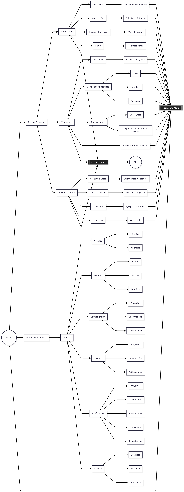
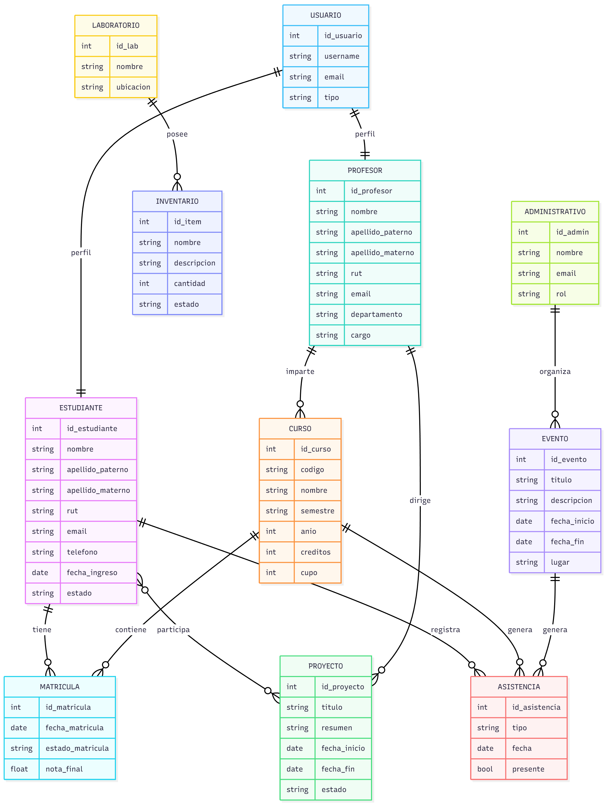

# Semana 1 – Comprensión, levantamiento y análisis del sistema EIEInfo

*II-2025*

Estudiantes: 
- Josué María Jiménez Ramírez, C13987
- Santiago Herra Castro, C13721

## 0. Resumen ejecutivo del sistema EIEInfo

EIEInfo es una plataforma web desarrollada para la Escuela de Ingeniería Eléctrica de la Universidad de Costa Rica. Su propósito es centralizar y automatizar la gestión académica, administrativa y de comunicación de la Escuela, brindando un espacio unificado para estudiantes, profesores, administrativos, egresados y público externo. La aplicación permite manejar desde la publicación de noticias y eventos hasta la administración de cursos, prácticas profesionales, laboratorios, inventario y proyectos académicos.

El sistema está construido sobre el framework **Django 4.1.3**, empleando **MariaDB** como gestor de base de datos y **Docker** para su despliegue modular y replicable. La arquitectura sigue el patrón **MTV (Model-Template-View)** de Django, equivalente al modelo **MVC**, lo que permite una separación clara entre la presentación, la lógica de negocio y la persistencia de datos. A nivel de infraestructura, se apoya en **Gunicorn** como servidor WSGI y **Nginx** como proxy inverso, integrando además servicios de automatización continua mediante **Drone CI/CD**.

EIEInfo está compuesto por diversas aplicaciones internas (apps), cada una orientada a un dominio funcional específico. Entre ellas destacan: **administrativos**, **profesores**, **estudiantes**, **laboratorios**, **proyectos**, **trabajos finales de graduación** y **práctica profesional**, las cuales gestionan los procesos internos de la Escuela; así como **anuncios**, **eventos**, **alumni** y **web_page**, dedicadas a la comunicación pública e institucional. Cada aplicación implementa los módulos base de Django (models, views, forms, templates, tests y utils) para garantizar coherencia estructural y mantenibilidad.

El análisis técnico reveló el uso de múltiples tecnologías complementarias, como **Bootstrap**, **jQuery**, **CKEditor**, **FullCalendar** y **Select2** para la interfaz, junto con bibliotecas especializadas para generación de reportes (LaTeX, PyPDF2, openpyxl), validación y seguridad. El sistema cuenta con una base de datos relacional que gestiona usuarios (estudiantes, profesores, administrativos) con atributos personalizados y relaciones con otras entidades, como cursos, proyectos, prácticas, publicaciones y eventos.

A nivel de arquitectura, el sistema presenta una estructura modular sólida, aunque se identifican áreas de mejora como la duplicación de código, la falta de una capa de servicios independiente, inconsistencias en la interfaz de usuario, validaciones dispersas y documentación incompleta. Se recomienda la introducción de una **capa de servicios**, la unificación de plantillas y componentes reutilizables, y la adopción de prácticas de seguridad y documentación estandarizadas.

En conjunto, EIEInfo representa una plataforma robusta y escalable que integra los distintos procesos académicos y administrativos de la Escuela de Ingeniería Eléctrica, con potencial para evolucionar hacia una arquitectura más mantenible, segura y orientada a servicios.


## 1. Revisión Inicial del Sistema

El proyecto de EIEInfo es un sitio web dedicado a la Escuela de Ingeniería Eléctrica de la Universidad de Costa Rica. Está diseñada para facilitar la labor informar, administrar y gestionar todo lo relacionado con profesores, estudiantes y externos vinculados a la Escuela de Ingenieria Eléctrica. El sitio web está construído con el framework Django 4.1.3 y utiliza el gestor de base de datos de tipo SQL y MariaDB. Por último, la herramienta Docker está implementada para un despliegue rápido hacia colaboradores. 

El funcionamiento del programa se puede dividir en 2 secciones: 
- Información sobre las actividades, proyectos, laboratorios etc de la Escuela de Ingenieria Electrica. 
- Gestor de procesos administrativos de los integrantes de la escuela  (estudiantes, profesores y administrativos). 

El sitio web posee múltiples módulos los cuales son los bloques más importantes del funcionamiento del sitio web, los módulos son los siguientes:

- Templates: Contienen las plantillas HTML que definen la estructura visual e interfaz del sitio web. Permiten integrar variables dinámicas, bucles y condiciones mediante el lenguaje de plantillas de Django, mostrando información proveniente del backend de manera personalizada para el usuario final.

- Models: Representan la estructura de la base de datos del sistema. Cada clase define una tabla y sus relaciones, gestionando los datos mediante el ORM de Django. Este módulo permite crear, leer, actualizar y eliminar registros sin necesidad de usar consultas SQL, garantizando la integridad y consistencia de la información.

- Reports: Se encarga de la generación de reportes e informes automáticos basados en la información almacenada en la base de datos para los diferentes usuarios. A través de este módulo, se crean documentos en distintos formatos Latex para despues convertirlos a PDF, útiles para exportar listados o documentación formal del sistema.

- Views: Actúa como el enlace entre las solicitudes del usuario y las respuestas del sistema. Cada vista recibe una petición, procesa la lógica correspondiente, consulta los modelos y devuelve una respuesta en formato HTML. Este módulo define el comportamiento principal del sitio y coordina la interacción entre el frontend y el backend.

- Forms: Gestiona los formularios utilizados para capturar datos de los usuarios. Valida la información antes de guardarla en la base de datos y facilita la integración con las vistas y plantillas. Este módulo permite manejar de forma eficiente la entrada de datos, aplicando reglas y restricciones establecidas por los modelos.

- Misc: Agrupa las funciones auxiliares y herramientas de soporte que complementan el funcionamiento del sitio. Incluye utilidades como envío de correos, generación de documentos, manejo de rutas o automatización de procesos internos. Su objetivo es mantener el código ordenado, modular y reutilizable dentro del proyecto.

- Test: contiene las pruebas unitarias y de integración del sistema. Este módulo permite verificar que cada componente del sitio web funcione correctamente de manera individual y en conjunto. A través de casos de prueba automatizados, se garantiza la calidad del código, la detección temprana de errores y el correcto comportamiento de las funcionalidades tras cada actualización.

Estos modulos son parte de cada uno de las aplicaciones que estan en el sitio web, consisten y son la estructura base que provee la herramienta Django. Las aplicaciones en el sitio web son:

- administrativos: App para el personal administrativo: gestión de ciclos, estudiantes, inventario, noticias, reportes y vistas administrativas.
- alumni: App para exalumnos: modelos, vistas y formularios relacionados a la comunidad de exalumnos.
- anuncios: App para anuncios/noticias públicas: modelos, formularios y vistas de publicación.
- asistencias: App para manejar las asistencias hacia los estudiantes y dada por profesores.
- atributos: App para anuncios/noticias públicas: modelos, formularios y vistas de publicación.
- conferencias: App para gestión de conferencias/eventos académicos.
- cursos: App de cursos para manejar modelos, vistas, reports y utilidades específicas de cursos y grupos.
- eieinfo: Core del proyecto: configuración Django (settings.py), backends, APIs (Facebook/Google), URLs y plantillas globales.
- estudiantes: App para manejar las funciones estudiantiles en conjunto con otras aplicaciones.
- eventos: App para gestionar la seccion de eventos.
- inventario: App para gestión de inventario y bienes de la escuela.
- laboratorio: App para gestión de laboratorios: equipos y espacio.
- practica_profesional: App para manejo de prácticas profesionales (documentos y flujo).
- profesores: App para profesores: gestión de cursos, nombramientos, proyectos, laboratorios y vistas para el profesorado.
- proyecto_electrico: App específica para los proyectos electricos proporcionados por los profesores.
- proyectos: App para gestión de proyectos (investigación/tesis/proyectos internos).
- trabajo_final_de_graduacion: Apps relacionadas a trabajos finales/TFG: gestión de solicitud, defensa y estados.
- trabajos_finales: App de apoyo a la aplicacion de rabajo final de graduacion y proyectos electricos.
- web_page: App del sitio principal de la escuela cuando se ingresa a la pagina.
- webclientes: Maneja las vistas estaticas de informacion del sitio web.

El sitio web almacena los usuarios existentes y su respectiva informacion para los 3 usuarios que pueden acceder a la pagina. Para cada usuario se posee: Nombre, Apelldo, correo, cedula, numero de telefono y contrasenna para el ingreso a su respectiva cuenta. Se agrega mas informacion dependiendo del usuario como por ejemplo carne o numero de empleado. La pagina almacena toda la informacion relacionada con las actividades concurrentes de la escuela como por ejemplo, los cursos disponibles es cada plan de estudios, ofertas de pasantias, proyectos electricos disponibles, publicaciones y articulos, asistencias disponibles de cada profesor y sus estudiantes. 


### Diagrama general del programa



## 2. Análisis técnico del sistema

### 2.1 Herramientas utilizadas: 

### 2.1.1 Lenguajes
| Lenguaje       | Dónde se usa                                   | Descripción                                                                                                                              |
| -------------- | ---------------------------------------------- | ---------------------------------------------------------------------------------------------------------------------------------------- |
| **Python**     | Backend Django, Gunicorn (WSGI), APIs externas | Lenguaje principal del servidor y lógica de negocio. Utilizado por Django, Gunicorn, y las integraciones con APIs (Google, OAuth, etc.). |
| **HTML**       | Interfaz Web (Frontend)                        | Estructura de las páginas web servidas al usuario final.                                                                                 |
| **CSS**        | Interfaz Web (Frontend)                        | Estilos visuales del sitio, diseño y presentación.                                                                                       |
| **JavaScript** | Interfaz Web y librerías JS locales            | Lenguaje para la lógica del lado del cliente. Usado con jQuery, Bootstrap, FullCalendar, Select2, etc.                                   |
| **YAML**       | DevOps / CI-CD (Drone CI)                      | Archivo `.drone.yml` para la configuración del pipeline de integración y despliegue continuo.                                            |
| **SQL**        | Base de datos (MySQL / PostgreSQL)             | Lenguaje para definir, consultar y modificar las tablas de usuarios, cursos, publicaciones, etc.                                         |


### 2.1.2 Frameworks

| Framework           | Tipo / Nivel                  | Dónde se usa                | Descripción                                                                                                    |
| ------------------- | ----------------------------- | --------------------------- | -------------------------------------------------------------------------------------------------------------- |
| **Django**          | Backend (principal)           | Backend Django              | Framework principal del lado del servidor. Maneja rutas, modelos, vistas, ORM y autenticación.                 |
| **Gunicorn (WSGI)** | Servidor de aplicaciones      | Entre Nginx y Django        | Framework/servidor WSGI que permite ejecutar la aplicación Django y manejar múltiples peticiones concurrentes. |
| **Nginx**           | Servidor web (reverse proxy)  | Servidor Web                | Maneja HTTPS, sirve contenido estático y redirige peticiones al backend (Gunicorn).                            |
| **Bootstrap**       | Frontend (UI framework)       | Interfaz Web                | Framework CSS y JS para diseño responsivo y componentes visuales.                                              |
| **jQuery**          | Frontend (JS framework)       | Interfaz Web / Librerías JS | Framework de JavaScript que simplifica manipulación del DOM y peticiones AJAX.                                 |
| **CKEditor**        | Frontend (editor)             | Interfaz Web                | Framework para edición de texto enriquecido (WYSIWYG). Integrado con Django mediante `django-ckeditor`.        |
| **FullCalendar**    | Frontend (JS framework)       | Interfaz Web                | Framework para gestión y visualización de calendarios en el navegador.                                         |
| **Select2**         | Frontend (JS framework)       | Librerías JS locales        | Framework de JavaScript para mejorar los campos de selección (`<select>`) con búsqueda dinámica.               |
| **Drone CI/CD**     | DevOps / Integración continua | CI/CD                       | Framework de automatización para pruebas y despliegue continuo basado en contenedores (usa YAML).              |


### 2.1.3 Librerías

| Categoría                                | Paquete / Librería       | Versión / Fuente |
| ---------------------------------------- | ------------------------ | ---------------- |
| **Extensiones y utilidades para Django** | django-extensions        | 3.2.1            |
|                                          | django-tagging           | 0.5.0            |
|                                          | django-polymorphic       | 3.1.0            |
|                                          | django-widget-tweaks     | 1.4.12           |
|                                          | django-datetime-widget2  | 0.9.5            |
|                                          | martor                   | 1.6.14           |
|                                          | django-recaptcha         | 3.0.0            |
|                                          | django-letsencrypt       | 4.1.0            |
|                                          | django-instagram         | 0.3.2            |
|                                          | django-ckeditor          | 6.5.1            |
|                                          | django-crontab           | 0.7.1            |diagaram_general
|                                          | django-select2           | 6.3.1            |
| **Documentación y conversión**           | docutils                 | 0.12             |
|                                          | Markdown                 | 3.3.4            |
|                                          | pypandoc                 | 1.3.3            |
| **Estilo y análisis de código**          | flake8                   | 3.5.0            |
|                                          | pycodestyle              | 2.3.0            |
|                                          | pyflakes                 | 1.6.0            |
| **APIs externas**                        | google-api-python-client | 1.5.3            |
|                                          | oauth2client             | 3.0.0            |
|                                          | facebook-sdk             | 2.0.0            |
| **Conectores y bases de datos**          | mysqlclient              | 2.1.1            |
| **Procesamiento general**                | Pillow                   | 9.4.0            |
|                                          | PyPDF2                   | 1.26.0           |
|                                          | sorl-thumbnail           | 12.9.0           |
| **Excel y reportes**                     | pyexcel-xls              | 0.4.0            |
|                                          | openpyxl                 | 3.1.2            |
|                                          | XlsxWriter               | 3.0.9            |
|                                          | vobject                  | 0.9.6.1          |
| **Parser académico**                     | scholarly                | 1.4.1            |
| **Pruebas y cobertura**                  | pytest                   | -                |
|                                          | pytest-django            | -                |
|                                          | coverage                 | -                |
| **Servidor de despliegue**               | gunicorn                 | 20.1.0           |

### 2.1.4 Dependencias

| **Tipo**              | **Dependencia**                | **Versión / Fuente**                                                                                           |
| --------------------- | ------------------------------ | -------------------------------------------------------------------------------------------------------------- |
| Soporte técnico       | importlib-metadata             | 6.1.0                                                                                                          |
|                       | pywatchman                     | 1.4.1                                                                                                          |
| Desde GitHub          | django-wiki                    | `git+https://github.com/rodrigo-garcia-leon/django-wiki@main#egg=wiki`                                         |
|                       | django-tagging (modificada)    | `git+https://github.com/rodrigo-garcia-leon/django-tagging@feature/add_support_for_django4#egg=django-tagging` |                                                                                          


### 2.2 Estructura de carpetas y responsabilidades

```text
EIEInfo/
├── docker/                 # Infraestructura de contenedores
│   ├── db/                 #   ↳ imagen MariaDB + init.sql
│   ├── django/             #   ↳ imagen Django + Gunicorn
│   ├── nginx/              #   ↳ imagen Nginx + vhost
│   └── drone-local/        #   ↳ pipeline de pruebas local
│
├── src/                    # Código fuente principal
│   ├── server/             #   ↳ proyecto Django
│   │   ├── apps/           #       ↳ aplicaciones modulares
│   │   │   ├── noticias/
│   │   │   ├── estudios/
│   │   │   ├── investigacion/
│   │   │   ├── docencia/
│   │   │   ├── accion_social/
│   │   │   └── escuela/
│   │   ├── templates/      #   ↳ plantillas HTML (Jinja2/Django-tpl)
│   │   ├── static/         #   ↳ CSS, JS, imágenes públicas
│   │   └── eieinfo/        #   ↳ settings, urls, wsgi, asgi
│   │
│   └── scripts/            #   ↳ utilidades de mantenimiento
│
├── resources/              # Archivos multimedia, diagramas y documentación
├── tests/                  # Tests unitarios y funcionales (pytest + Selenium)
├── .env.example            # Variables de entorno de referencia
├── docker-compose.yml      # Orquestación de los servicios
└── README.md               # Guía de levantamiento rápido (enlace cruzado)
```
Extraído de: ```https://git.ucr.ac.cr/eieinfo/EIEInfo/-/wikis/home/Estructura-Proyecto```


### 2.3 Arquitectura aplicada

### Análisis de la Arquitectura Aplicada

| Aspecto | Descripción |
|:--------:|:------------|
| **Tipo de arquitectura** | Arquitectura en capas basada en el patrón **MVC** (Model-View-Controller), implementada a través del framework **Django**, con una separación lógica clara entre presentación, lógica de negocio y persistencia. |
| **¿MVC clásico?** | Parcialmente. Django utiliza un patrón **MTV (Model-Template-View)**, equivalente al MVC clásico. Los *models* representan los datos y su persistencia, los *templates* funcionan como la capa de vista y las *views* contienen la lógica de control. |
| **¿Capas lógicas bien separadas?** | Sí. Las capas están organizadas modularmente dentro de `src/server/...`, donde cada aplicación tiene sus propios modelos, vistas, plantillas y archivos estáticos. La capa de presentación (HTML, CSS, JS) está en `templates/` y `static/`, mientras que la lógica de negocio y persistencia reside en las aplicaciones de Django. |
| **¿Hay acoplamiento?** | Cada aplicación dentro de `src/server/.../...` es independiente y puede desarrollarse o probarse por separado. Sin embargo, comparten configuraciones globales comunes (`urls.py` por ejemplo), lo que introduce un acoplamiento moderado a nivel de servidor. |
| **¿Se usan patrones?** | Sí. Django implementa de forma nativa varios patrones: **MTV (MVC modificado)**, **ORM (Object-Relational Mapping)** para persistencia, **Template Pattern** para vistas y **Singleton** en la gestión de configuración. Además, se emplea el patrón **Repository** en el uso del ORM. |

---

### Detalle de responsabilidades

| Pregunta | Respuesta |
|:---------:|:----------|
| **¿Dónde reside la lógica de negocio?** | En las *views* y *models* de cada aplicación dentro de `src/server/apps/`. Las *views* controlan el flujo de ejecución y coordinan la interacción entre los modelos y las plantillas, mientras que los *models* definen la lógica de dominio asociada a los datos. |
| **¿Dónde se administra la persistencia?** | En los *models* de Django (dentro de cada app) mediante el **ORM**. El acceso físico a la base de datos se gestiona a través del contenedor `db/` en `docker/`, que ejecuta **MariaDB** con un script de inicialización `init.sql`. |
| **¿Cómo se valida la información?** | Se valida en dos niveles: (1) en el servidor, mediante los **ModelForms** y las validaciones del ORM en Django, y (2) en la interfaz, mediante validaciones en los formularios HTML y posibles scripts JavaScript en `static/`. |
| **¿La arquitectura facilita agregar módulos? ¿Por qué?** | Sí. La estructura modular de Django permite agregar nuevas aplicaciones en `src/server/apps/` sin afectar las existentes. Basta con definir un nuevo módulo con sus modelos, vistas, URLs y plantillas. El uso de contenedores también facilita escalar o añadir servicios adicionales (por ejemplo, un microservicio o una API REST) sin modificar la estructura base. |


##  3. Levantamiento de arquitectura y diagramas

### Diagrama de Arquitectura General


### Diagrama de componentes o módulos actuales


### Modelo general de datos



##  4. Identificación de problemas y oportunidades


## 4.1. Sección de Información
En esta sección se analizaron las pestañas desplegables del encabezado del sitio web. Esto incluye "Noticias", "Estudios", "Investigación", "Docencia", "Acción Social", "Escuela" y "Egresados".

### 4.1.1. Código Duplicado: 
- Se repite la misma lógica de búsqueda en múltiples modelos (```Search``` en ```anuncios.Anuncio```, ```cursos.Curso```, ```proyectos.Publicacion```, etc.).
Esto provoca duplicación de comportamiento y aumenta el esfuerzo cuando se quiere mejorar la búsqueda global o su rendimiento.

- Múltiples modelos implementan utilidades similares (p. ej. ```SetPassword```, ```SetImagenDefault```) con variantes mínimas (```estudiantes.Estudiante```, ```alumni.Alumnus```, otros).
Mantener el hashing, el saneamiento de nombres de archivo y selección de imagen por defecto en varios lugares facilita errores inconsistentes.

- Plantillas y fragmentos de interfaz se repiten: listas, paginadores y sidebars se construyen en cada app sin un patrón compartido de componentes de plantilla.

**Solución recomendada:**

Extraer utilidades comunes (módulo utils/validators.py, utils/files.py, utils/search.py) y sustituir duplicados por llamadas a esos helpers; unificar la implementación de búsqueda en un helper reutilizable.

### 4.1.2. Falta de modularidad
- No hay una capa de servicios clara: operaciones con efectos externos (envío de correos, llamadas a APIs externas, generación de PDFs) se realizan directamente en modelos y formularios. Ejemplos:

    - ```anuncios.Anuncio.PostearEnFacebook()``` construye mensaje, decide attachments y hace la llamada a la API de Facebook.
    - ```cursos.Curso.ProgramaPDF()``` y métodos relacionados invocan ```GenerarLaTeX(...)``` escribiendo ficheros desde el modelo.
    - Múltiples métodos ```EnviarEmail...``` se ejecutan desde modelos (p. ej. ```PracticaProfesional.Notificar...```, ```OfertaEmpleo.EnviarEmailAdvertencia()```).

- Formularios y vistas orquestan persistencia y efectos secundarios (por ejemplo: ```AnuncioForm.save()``` escribe el anuncio y dispara cambios de estado/etiquetado).
Esto rompe la separación de responsabilidades (los modelos deberían representar datos; los servicios orquestar I/O).

- No se usan managers personalizados o una carpeta services/ para centralizar lógica de dominio reutilizable.

**Solución recomendada:**

Crear una capa de servicios por dominio (por ejemplo, ```services/email.py```, ```services/social.py```, ```services/pdf.py```, ```services/workflows.py```) y mover allí la lógica de I/O y orquestación. Los modelos pasarán a exponer sólo datos y estados, y las vistas llamarán a servicios.


### 4.1.3. Problemas de UI/UX
-  Plantillas inconsistentes entre módulos: navegación, mensajes y disposición varían entre ```anuncios```, ```cursos```, ```proyectos``` y ```alumni```, lo que rompe la continuidad visual del sistema.

- Falta de componentes reutilizables para encabezados, formularios y alertas. Muchas plantillas repiten la misma estructura en lugar de extender componentes base (base.html y bloques).

- Formularios para trámites largos (p. ej. solicitud de Práctica Profesional) presentan demasiados campos en una sola pantalla; no hay wizards o pasos que mejoren la tasa de finalización y reduzcan errores.

- Feedback insuficiente: ausencia de indicadores de carga/reintento para operaciones que tardan (generación de PDF, envío de correo, llamadas a redes sociales).

**Solución recomendada:**

Implementar una plantilla base homogénea, extraer componentes (incluidos snippets para paginador y sidebars), y usar un wizard (p. ej. ```django-formtools.SessionWizardView```) para trámites complejos. Adoptar un framework CSS común (Bootstrap/Tailwind) para consistencia visual y responsividad.


### 4.1.5. Falta de validación o seguridad
- Autenticación y sesiones replicadas: algunas aplicaciones usan formularios y flags de sesión hechos a la medida (por ejemplo ```alumni.LoginAlumnusForm```, ```estudiantes.EstudianteLoginForm```), en lugar del modelo User de Django y las utilidades provistas por ```django.contrib.auth```. Esto produce:

  - Ausencia de controles estándar de permisos y roles.
  - Mayor riesgo por errores en la gestión de sesiones (expiración, fijación de sesión).
  - Dificultad para usar decoradores/mixtos nativos (```login_required```, ```PermissionRequiredMixin```).
   
- Validaciones incorrectas o incompletas:

  - Bug concreto: en anuncios.forms.AnuncioForm.clean_final se crea un ValidationError pero no se lanza (```forms.ValidationError(...)``` en vez de ```raise ...```), por lo que la comprobación no bloquea entradas inválidas.
  - ```PathArchivoAnuncio``` hace ```.encode('ascii', 'ignore')``` y retorna bytes en lugar de str, lo que puede causar problemas en backends de almacenamiento.
  - Uso de ```locale.setlocale(...)``` en vistas (```anuncios.pantallas```) es dependiente del entorno y puede fallar en despliegues sin locales instalados.

- Manejo de excepciones demasiado genérico (```except:``` sin especificar excepciones) oculta errores reales y dificulta logging y trazabilidad.

- Falta de validación centralizada de archivos subidos (tipo MIME, tamaño) y filtrado consistente de HTML/entrada externa (aunque hay usos puntuales de bleach, no es homogéneo).

**Solución recomendada:**

Adoptar Django auth (usar ```User``` y adaptadores si hace falta), activar middleware y decoradores de seguridad, centralizar validadores (password policy, IBAN, email institucional) y aplicar sanitización consistente (usar ```bleach``` donde se permita HTML). Corregir los bugs detectados (ej.: ```raise``` en clean_final; decodificar filename). Reemplazar ```except:``` por capturas explícitas y registrar errores.


### 4.1.6. Carencia de documentación

- Falta de README por aplicación que describa dependencias, variables de entorno (tokens de Facebook, ```URL_ROOT_PATH```), y pasos de configuración local/producción.

- Ausencia de documentación técnica que explique los contratos de los servicios externos: qué credenciales se requieren, tiempo de expiración esperado, y cómo funcionan los estados (por ejemplo ```ESTADOS_FACEBOOK```).

- Docstrings parciales: muchos métodos tienen docstrings, pero funciones complejas que orquestan llamadas externas o procesos largos carecen de documentación operativa y ejemplos de uso.

- No hay diagramas de arquitectura ni mapa de relaciones críticas (por ejemplo qué apps usan ```EnviarEmailTemplate```, quién llama a ```GenerarLaTeX```).

**Solución recomendada:**

Agregar README por app (variables de entorno, permisos), documentar servicios externos y sus requisitos, crear un documento de arquitectura y añadir docstrings/ejemplos en los servicios extraídos.


### 4.1.7. Lógica mezclada entre capas
- Lógica de negocio, presentación y efectos externos aparece repartida entre modelos, vistas y formularios:

    - Ejemplo: Anuncio.PostearEnFacebook() (modelo) arma mensaje, decide attachments, llama a API y cambia estado.
    - Ejemplo: formularios que no solo validan sino que crean/guardan y disparan side-effects (emails, tags).

- Los modelos realizan I/O directo (envíos a redes sociales, generación de PDFs, envío de correos), lo que produce fuerte acoplamiento y dificulta pruebas unitarias.

**Solución recomendada:**

Aplicar con disciplina el patrón MVT:

- Models: solo campos, validaciones básicas y managers (consultas).
- Views: orquestación y presentación (invocan servicios y renderizan).
- Services/Utils: llamadas externas, generación de documentos y flujos de trabajo.
- Además: introducir managers para consultas complejas y transferir la lógica de negocio a clases de servicio con pruebas unitarias dedicadas.

## 4.2. Sección de Usuarios

A partir del análisis de las tres aplicaciones principales (Estudiantes, Administrativos y Profesores), se identificaron una serie de problemas que afectan la mantenibilidad, seguridad y consistencia del sistema.  
A continuación, se describen los problemas más recurrentes y críticos encontrados.

### 4.2.1. Código Duplicado: 
- Se encontró una gran cantidad de plantillas de correo electrónico duplicadas en formato `.html` y `.txt`, manteniendo el mismo contenido en ambos archivos.  
  Este patrón se repite en todas las aplicaciones y genera una sobrecarga innecesaria de mantenimiento.

- Existen vistas con lógica repetida, especialmente en la creación de contextos, validaciones de formularios y envío de correos.  
  Cada aplicación implementa procesos similares en distintos archivos sin reutilización de funciones o clases comunes.

- Múltiples plantillas de interfaz (listas, formularios y detalles) repiten la misma estructura visual sin un sistema de componentes o herencia base.


**Solución recomendada:** 
 
Implementar plantillas base reutilizables, crear un módulo común de servicios y emplear herencia de templates y funciones compartidas.


### 4.2.2. Falta de modularidad

- No existe una capa de servicios (service layer) que separe la lógica de negocio de las vistas como se puede ver en el diagrama de modulos. La mayoría de las operaciones complejas (envío de correos, validaciones, generación de reportes) se realizan directamente en las vistas.

- La lógica está mezclada entre vistas, formularios y modelos, rompiendo el principio de separación de responsabilidades.

- No se usan managers ni clases utilitarias compartidas para operaciones repetitivas en las tres aplicaciones.

**Solución recomendada:**  
Crear servicios independientes por dominio (por ejemplo, `EmailService`, `ReportService`, `UserValidationService`) y mover la lógica repetida a módulos compartidos.


### 4.2.3. Problemas de UI/UX

- Las plantillas no siguen una estructura visual coherente, presentando navegación y diseño inconsistente entre módulos.

- No existe un sistema de componentes reutilizables para encabezados, formularios, alertas o tablas, generando duplicación visual.

- Falta de responsividad y retroalimentación al usuario (mensajes de carga, confirmación o error).

- La navegación difiere entre aplicaciones, lo que dificulta la experiencia del usuario y rompe la continuidad visual del sistema.

**Solución recomendada:**  
Implementar una estructura de plantillas base (`base.html`), crear componentes visuales reutilizables y adoptar un framework CSS consistente.


### 4.2.4. Falta de validación o seguridad

Uso de autenticación personalizada en lugar del sistema de usuarios integrado de Django, lo que provoca:
  - Falta de protección CSRF.
  - Ausencia de control de permisos.
  - Vulnerabilidad ante ataques de fuerza bruta (sin rate limiting).
  - Riesgo de fijación de sesión y pérdida de trazabilidad.

- Validaciones ausentes o dispersas entre vistas y modelos, permitiendo el procesamiento de datos sin sanitización.

- Acceso directo a objetos del modelo sin verificación de permisos (por ejemplo, editar registros ajenos sin comprobación de propiedad).

- Exposición de datos sensibles, como contraseñas, correos institucionales o configuraciones internas, en archivos de utilidades.

**Solución recomendada:**  
Adoptar los decoradores y middleware de seguridad nativos de Django (`@login_required`, `PermissionRequiredMixin`), activar CSRF en formularios y centralizar la autenticación mediante el modelo `User`.


### 4.2.5. Carencia de documentación

- Ausencia de docstrings en funciones y clases complejas.
- Falta de documentación técnica que explique el propósito y estructura de cada módulo.
- Inexistencia de `README` por aplicación o guía de despliegue.
- Sin documentación sobre la estructura de base de datos ni diagramas de relación entre modelos.

**Solución recomendada:**  
Agregar docstrings detallados, documentación técnica por módulo, diagramas de arquitectura y una guía general de desarrollo.


### 4.2.6. Lógica mezclada entre capas

- Se detectó lógica de sitio web implementada dentro de los modelos, vistas y formularios simultáneamente.  
  Ejemplo: validaciones, envío de correos y cálculos de estado dentro de métodos del modelo.

- Los modelos manejan tareas que deberían corresponder a servicios externos o controladores, generando alta dependencia entre capas.

**Solución recomendada:**  
Seguir el patrón MVC/MVT de forma estricta:
- **Models:** solo definición de datos y relaciones.  
- **Views:** orquestar lógica y presentación.  
- **Services/Utils:** manejar operaciones complejas y procesos reutilizables.

## 4.3. Oportunidades de mejora

1. Creación de capa de servicio: El sitio web necesita tener un modulo de servicio por cada aplicacion que posee la pagina, se necesita tener un modulo intermedio entre el modulo de `models.py` y `view.py` para poder manejar la logica de servicios de manera separada a la vista en la aplicacion.
2. Patrón de diseño Singleton para autenticación: Se podría implementar el patrón de diseño Singleton para garantizar que solo exista una única instancia de inicio de sesión por usuario dentro del sitio web, evitando múltiples sesiones simultáneas y asegurando un control más eficiente del acceso.
3. Migrar al sistema de autenticación nativo de Django:  
Sustituir los sistemas personalizados de login por el modelo `User` y las clases `AbstractUser` o `AbstractBaseUser`.  
Esto garantiza soporte para contraseñas cifradas, permisos y sesiones seguras.
4. Activar y aplicar la protección CSRF: Asegurar que todos los formularios incluyan la etiqueta `` para prevenir ataques de falsificación de solicitudes.
5. Centralización del envío de correos: Eliminar las llamadas directas a `EnviarEmail()` dentro de modelos o vistas, y reemplazarlas por un servicio dedicado.

6. Estandarizar la creación de contextos: Crear un constructor de contextos reutilizable (`ContextBuilder`) para evitar duplicación de código en múltiples vistas.

7. Pruebas unitarias y de integración: Incluir pruebas en el módulo `tests/` para asegurar que cada capa funcione correctamente de forma independiente.

8. En cada módulo incluir un `README.md` que resuma de lo que se encarga cada uno y cómo debe usarse, así como las interconecciones. De esta manera sería más fácil para un nuevo desarrollador comprender del contexto de lo que trabaja y realizar consultas. 

