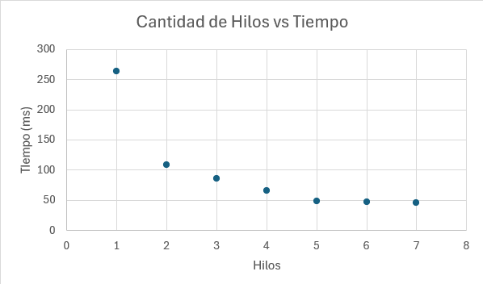

# Laboratorio de Programacion Paralela y Concurrente
Santiago Herra Castro - Prof. Esteban Badilla - Curso: Diseño de Software
---
## Fundamentos practicos de concurrencia

El programa crea cuatro hilos que ejecutan una misma función llamada tarea. Cada hilo recibe un número identificador y ejecuta un bucle que imprime su id junto con el número de iteración actual. Entre cada impresión, el hilo se detiene durante 200 milisegundos mediante la función sleep_for, lo que simula una pausa o trabajo en progreso. Mientras tanto, los otros hilos pueden ejecutarse en paralelo. El hilo principal crea los cuatro hilos y luego llama a join en cada uno para asegurarse de que todos terminen antes de imprimir el mensaje de finalización. La salida generada refleja la ejecución concurrente de los hilos.

### Patrón de ejecución observado

El patrón observado en la salida es intercalado y no determinista. Esto significa que las líneas impresas por los diferentes hilos aparecen mezcladas y el orden puede variar cada vez que se ejecuta el programa. Esta variabilidad ocurre porque el sistema operativo decide qué hilo ejecutar en cada instante, distribuyendo el tiempo de CPU entre ellos. La llamada a sleep introduce pausas uniformes dentro de cada hilo, pero no sincroniza los hilos entre sí. La única secuencia garantizada es que el mensaje final de ejecución aparece al final, cuando todos los hilos han completado su trabajo.

### Control del orden de ejecución

Existen formas de controlar el orden sin modificar la lógica principal de la función tarea.  
1. Ejecutar y unir cada hilo de forma secuencial, creando un hilo, esperando a que termine con join y luego lanzando el siguiente. Este método asegura un orden predecible pero elimina la ejecución concurrente.  
2. Usar mecanismos de sincronización como condition_variable o semáforos para permitir que un hilo ejecute su parte solo cuando sea su turno, manteniendo la concurrencia pero coordinando el orden de impresión.  
3. Si el objetivo es únicamente evitar que las salidas se mezclen, se puede proteger la escritura en consola con un mutex, lo que hace que las líneas se impriman completas pero en un orden determinado por el planificador.

## Sincronizacion y exclusion mutua

## Variables de condicion (modelo productor-consumidor)

### Se elimina el cv_productor.wait

Si se elimina la llamada a  
cv_productor.wait(lock, [] { return buffer.size() < BUFFER_SIZE; });  
el productor dejaría de verificar si el búfer tiene espacio disponible antes de insertar una nueva tarea.  
Esto causaría que todos los productores continúen generando tareas sin detenerse, llenando el búfer sin límite. Como consecuencia:

- El búfer (std::queue<int> buffer) crecería indefinidamente, provocando un uso excesivo de memoria.  
- Se perdería la sincronización entre productores y consumidores, ya que los consumidores podrían quedarse atrás en el procesamiento.  
- El objetivo de mantener un tamaño máximo del búfer (BUFFER_SIZE = 5) se rompería completamente.  

## ¿Por qué se usa unique_lock y no lock_guard en este caso?

Se usa std::unique_lock<std::mutex> en lugar de std::lock_guard<std::mutex> porque unique_lock permite bloquear y desbloquear el mutex de manera flexible y es compatible con las variables de condición.

En particular:
- cv_productor.wait(lock, ...) y cv_consumidor.wait(lock, ...) necesitan un unique_lock, ya que la función wait libera automáticamente el mutex mientras el hilo está dormido y lo vuelve a bloquear cuando se despierta.  
- lock_guard no permite ese comportamiento; su diseño es más simple y el mutex permanece bloqueado hasta que el objeto sale de alcance.  

Por tanto, el unique_lock es necesario cuando se usa una condition_variable, ya que proporciona control dinámico del bloqueo y permite coordinar la espera y reanudación de los hilos.

## ¿Qué garantiza cv_consumidor.notify_all()?

La instrucción  
cv_consumidor.notify_all();  
sirve para despertar a todos los hilos consumidores que estén esperando en la condición:  
cv_consumidor.wait(lock, [] { return !buffer.empty() || done; });  

Esto garantiza que, una vez que un productor ha insertado una tarea en el búfer, los consumidores sean notificados de que hay trabajo disponible.  
De esta forma:
- Si el búfer estaba vacío, los consumidores bloqueados se reactivan para procesar las nuevas tareas.  
- También se usa al final del programa para notificar a los consumidores de que el proceso ha terminado (done = true), permitiendo que salgan del bucle while y finalicen correctamente.

## Mecanismos avanzados y analisis de rendimiento

Se realizo el programa pool_conections.cpp para poder emplear el uso de semaforos y barreras, donde los hilos son manejados por un semaforos en un vector hasta llegar a una barrera donde todos esperan hasta que lleguen todos. En el comando de compilacion se le debe agregar como bandera -std=c++20 -pthreads, para especificar la version del compilador.

### Experimento de rendimiento
Se creo un script en powershell para poder registrar el tiempo de ejecucion de la tarea realizada en **productor_consumidor.cpp** aumenta la cantidad de consumidores para un mismo valor de productores y tareas. Se graficaron los graficos como se puede en la siguiente figura:

Se puede ver que el rendimiento no escala linearmente, esto es gracias, gracias que existe recursos limitados para la cantidad de hilos que pueden estar en ejecucion y que pueden resolver en este caso las tareas, aumentar el numero de hilos genera en este caso una especie de cola.

## Analisis conceptual
### 1. Diferencia entre paralelismo y concurrencia según los resultados experimentales

La concurrencia se refiere a la ejecución de múltiples tareas que progresan de manera intercalada, compartiendo recursos del sistema operativo, mientras que el paralelismo implica que las tareas se ejecutan realmente al mismo tiempo en diferentes núcleos del procesador.  
En las pruebas realizadas, la concurrencia se observó en programas que alternaban la ejecución de hilos (por ejemplo, productor-consumidor), mientras que el paralelismo fue evidente cuando varios hilos pudieron operar simultáneamente sobre distintos recursos sin interferirse, aprovechando múltiples núcleos.

### 2. Ventajas y desventajas al aumentar el número de hilos

**Ventajas**
- Mejora del rendimiento cuando las tareas son independientes y el hardware tiene varios núcleos disponibles.  
- Mejor aprovechamiento del tiempo de CPU, especialmente en operaciones de entrada/salida.  

**Desventajas**
- Mayor sobrecarga por la creación y administración de hilos.  
- Incremento de la competencia por recursos compartidos, lo que puede generar bloqueos o esperas.  
- Riesgo de condiciones de carrera si no se sincronizan correctamente las operaciones.  

### 3. Mecanismos necesarios para evitar condiciones de carrera

Se utilizaron mecanismos de sincronización como `std::mutex`, `std::lock_guard`, `std::unique_lock`, `std::condition_variable`, y en versiones más recientes `std::counting_semaphore` y `std::barrier`.  
Estos mecanismos garantizan que solo un hilo acceda a un recurso compartido a la vez o que todos los hilos lleguen a un punto de sincronización antes de continuar. Sin ellos, se producirían inconsistencias en los datos y resultados impredecibles.

### 4. Impacto de los mecanismos de sincronización en el rendimiento

La sincronización introduce esperas y bloqueos que reducen el paralelismo efectivo.  
Aunque garantizan la corrección de los datos, también añaden latencia porque los hilos deben esperar su turno para acceder a los recursos protegidos.  
El resultado es una compensación entre seguridad y rendimiento: más sincronización implica mayor estabilidad pero menor velocidad global.

### 5. Aprendizaje sobre el costo de crear y administrar hilos

Crear y mantener hilos tiene un costo en memoria y tiempo de planificación.  
El sistema operativo debe asignar pilas, contextos y tiempos de CPU para cada hilo.  
En programas con muchos hilos pequeños, la sobrecarga puede ser mayor que el beneficio, especialmente si las tareas no son lo suficientemente largas o independientes.  
Por eso, un número excesivo de hilos puede degradar el rendimiento en lugar de mejorarlo.

### 6. Optimización del balance entre granularidad y rendimiento

Para optimizar el equilibrio entre granularidad y rendimiento, es necesario ajustar el tamaño de las tareas a la cantidad de trabajo que justifique el costo de administrar los hilos.  
Las tareas deben ser lo suficientemente grandes para amortizar la creación del hilo, pero no tan grandes como para bloquear a otros hilos.  
El uso de mecanismos como pools de hilos o semáforos ayuda a mantener este equilibrio, reutilizando hilos activos y evitando la sobrecarga innecesaria.