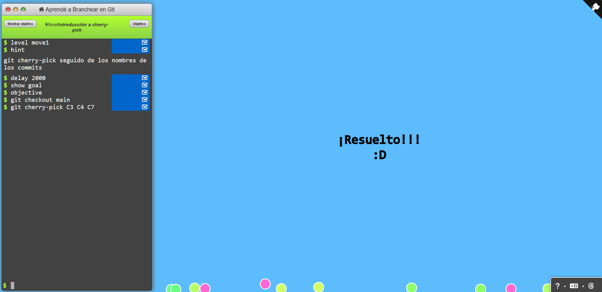

# Universidad de Costa Rica
## Facultad de Ingeniería  
### Escuela de Ingeniería Eléctrica  
**Diseño de software IE0417**  

**Ciclo:**  
**Tarea:** Control de versiones y documentación de software  

**Autor:** Santiago Herra Castro  
**Grupo:** 01  
**Profesor:** Esteban Badilla  
**Fecha:** 10/9/2025  

---

## Índice
1. [Control de versiones con Git](#control-de-versiones-con-git)  
2. [Documentación con Doxygen](#documentación-con-doxygen)  
3. [Documentación con Sphinx](#documentación-con-sphinx)  
4. [Publicación en Netlify](#publicación-en-netlify)

---

## Control de versiones con Git

Se realizaron los ejercicios de **gitlearningbranching**, se pueden ver los ejercicios de manera secuencial en las figuras a continuación.

- **Figura 1:** Nivel: Brancheando en Git  
- **Figura 2:** Nivel: Mergeando en Git  
- **Figura 3:** Nivel: Introducción a rebase  
- **Figura 4:** Nivel: Desatachea tu HEAD  
- **Figura 5:** Nivel: Referencias relativas  
- **Figura 6:** Nivel: Referencias relativas 2  
- **Figura 7:** Nivel: Revirtiendo cambios en Git  
- **Figura 8:** Nivel: Introducción a cherry-pick  
- **Figura 9:** Nivel: Introducción a rebase  
- **Figura 10:** Nivel: Tomando un único commit  
- **Figura 11:** Nivel: Haciendo malabares con los commits  
- **Figura 12:** Nivel: Haciendo malabares con los commits 2  
- **Figura 13:** Nivel: Tags en Git  
- **Figura 14:** Nivel: Git Describe  
- **Figura 15:** Nivel: Rebaseando más de 900 veces  
- **Figura 16:** Nivel: Múltiples padres  
- **Figura 17:** Nivel: Ensalada de branches  

---

## Documentación con Doxygen

Se utilizó la herramienta **Doxygen** para generar un archivo HTML de un programa previamente documentado en Doxygen.  

Se clonó el repositorio *Math Operations: A simple C project demonstrating basic math operations* para poder generar la documentación como se puede ver en la **Figura 18**.  

- **Figura 18:** Creación de documentación en Doxygen  
- **Figura 19:** Archivo HTML generado por Doxygen  

**Espacio para las imágenes de la página de publicación:**
# Universidad de Costa Rica
## Facultad de Ingeniería  
### Escuela de Ingeniería Eléctrica  
**Diseño de software IE0417**  

**Ciclo:**  
**Tarea:** Control de versiones y documentación de software  

**Autor:** Santiago Herra Castro  
**Grupo:** 01  
**Profesor:** Esteban Badilla  
**Fecha:** 10/9/2025  

---

## Índice
1. [Control de versiones con Git](#control-de-versiones-con-git)  
2. [Documentación con Doxygen](#documentación-con-doxygen)  
3. [Documentación con Sphinx](#documentación-con-sphinx)  
4. [Publicación en Netlify](#publicación-en-netlify)

---

## Control de versiones con Git

Se realizaron los ejercicios de **gitlearningbranching**, se pueden ver los ejercicios de manera secuencial en las figuras a continuación.

- **Figura 1:** Nivel: Brancheando en Git

- **Figura 2:** Nivel: Mergeando en Git

- **Figura 3:** Nivel: Introducción a rebase

- **Figura 4:** Nivel: Desatachea tu HEAD

- **Figura 5:** Nivel: Referencias relativas

- **Figura 6:** Nivel: Referencias relativas 2

- **Figura 7:** Nivel: Revirtiendo cambios en Git

- **Figura 8:** Nivel: Introducción a cherry-pick

- **Figura 9:** Nivel: Introducción a rebase

- **Figura 10:** Nivel: Tomando un único commit

- **Figura 11:** Nivel: Haciendo malabares con los commits

- **Figura 12:** Nivel: Haciendo malabares con los commits 2

- **Figura 13:** Nivel: Tags en Git 

- **Figura 14:** Nivel: Git Describe 

- **Figura 15:** Nivel: Rebaseando más de 900 veces

- **Figura 16:** Nivel: Múltiples padres

- **Figura 17:** Nivel: Ensalada de branches  

---

## Documentación con Doxygen

Se utilizó la herramienta **Doxygen** para generar un archivo HTML de un programa previamente documentado en Doxygen.  

Se clonó el repositorio *Math Operations: A simple C project demonstrating basic math operations* para poder generar la documentación como se puede ver en la **Figura 18**.  

- **Figura 18:** Creación de documentación en Doxygen

- **Figura 19:** Archivo HTML generado por Doxygen  

---

## Documentación con Sphinx

Se utilizó la herramienta **Sphinx** para generar la documentación de un repositorio basado en Python.  

Se clonó el repositorio *Example: Basic Sphinx project for Read the Docs*, siguiendo un flujo similar al anterior, mostrado en las figuras **20** y **21**.  

- **Figura 20:** Creación de documentación en Sphinx

- **Figura 21:** Archivo HTML generado por Sphinx  

---

## Publicación en Netlify

Los archivos HTML generados fueron publicados en **Netlify**. A continuación los enlaces:  

- [Documentación Doxygen en Netlify](https://luminous-lollipop-d3ed67.netlify.app/)  
- [Documentación Sphinx en Netlify](https://tiny-yeot-6144a4.netlify.app/)  

- **Figura 22:** Archivo HTML generado por Doxygen en Netlify

- **Figura 23:** Archivo HTML generado por Sphinx en Netlify