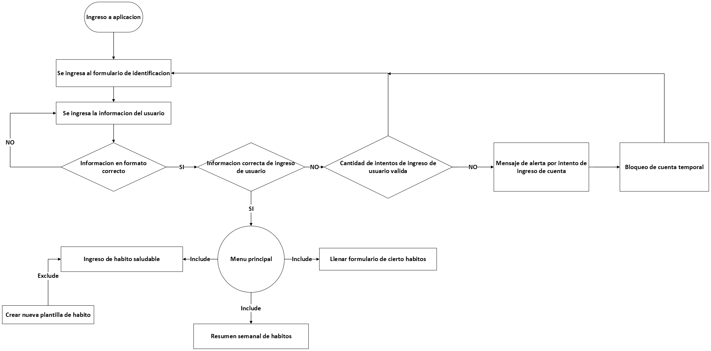

# Laboratorio 5.2

**Objetivo:** Aplicar técnicas de análisi de requerimientos y modelado de casos de uso con profundidad profesional. 

**Estudiantes:** 
- Josué M. Jiménez Ramírez, C13987
- Santiago Herra Castro C13721,
- Luis Soto B77551

# App para seguimiento de hábitos saludables
## Lista de requerimientos
### Requerimientos funcionales:
- El usuario deber ser capaz de autenticarse con usario/contraseña
- El usuario podrá elegir entre una serie de plantillas predefinidas sobre hábitos saludables. Ejemplo: correr, ir al gimnasio, leer, meditar, dibujar,...
- Debe existir un botón para que el usuario pueda llenar un formulario para crear sus hábitos personalizados (cualquiera que no esté en las plantillas).
- Cada vez que el usuario desee agregar un usuario, debe llenar un formulario para indicar qué días, a qué hora y cúando desea una notificación de recordatorio.
- La app debe mostrar un resumen semanal del rendimiento alcanzado (compromiso con el hábito).

### Requerimientos no funcionales:
- Disponibilidad: Si el servidor falla, deber recuperarse un plazo no mayor a 5 minutos.
- Seguridad: Los datos personales (contraseñas, edad, sexo, horarios, etc.) deben ser enviados de manera cifrada usando hash.
- Portabilidad: Se podrá acceder a la App desde iOS, Android y de manera Web.

### Requerimientos técnicos:
- El backend de la aplicación estará desarollado en Python usando la librería de Django. 

## Redacción de 2 casos de uso detallados
### Primer caso: El usuario debe ser capaz de autenticarse con usuario y contraseña

#### Actor principal: 
- Usuario

#### Precondiciones:
- El sistema de autenticación debe estar operativo y accesible.
- La base de datos de usuarios debe estar disponible y funcionando correctamente.
- El usuario debe de existir en la base de datos de usuarios registrados.
- El usuario debe de conocer sus credenciales.
- Debe existir conectividad entre el cliente y el servidor.

#### Postcondiciones:
- Se le otorga o deniega el acceso al usuario dependiendo del match de la información brindada con la disponible en la base de datos.
- Si el acceso fue otorgado, se redirige al usuario a la página de inicio correspondiente.
- Si el acceso fue otorgado, se le brindan las funcionalidades de usuario correspondiente al usuario que inició sesión.
- El sistema crea y mantiene una sesión activa para el usuario.
- Si el acceso fue denegado, se muestra un mensaje de fallo de autenticación al usuario.
- Se registra el intento fallido del usuario.

#### Flujo Principal:
- El usuario accede al formulario de autenticación.
- El usuario ingresa su nombre de usuario / correo y contraseña.
- El usuario presiona el botón de "ingresar"
- El sistema valida que los campos no estén vacíos y que tengan el formato correcto.
- El sistema envía las credenciales al servicio de autenticación.
- El servicio de autenticación consulta la base de datos de usuarios.
- El sistema verifica que el nombre de usuario exista y que la contraseña coincida con la registrada.
- Si las credenciales son correctas, el sistema crea una sesión activa para el usuario.
- El sistema redirige al usuario a la página principal o al panel correspondiente a su rol.
- El usuario termina autenticado y con acceso autorizado a las funcionalidades permitidas.

#### Flujo Alternativo:

**A1 - Contraseña incorrecta**

1. El sistema incrementa el contador de intentos fallidos para el usuario.  
2. El sistema muestra un mensaje indicando que las credenciales son inválidas. 
3. El sistema permite al usuario volver a intentar la autenticación. 
4. El sistema le permite al usuario intentar la autenticación nuevamente.

**A2 - Usuario no registrado**
1. El sistema muestra un mensaje indicando que el usuario no está registrado. 
2. El sistema le permite al usuario la posibilidad de registrarse o ingresar nuevamente las credenciales.

**A3 - Cuenta bloqueada por exceso de intentos**
1. El sistema bloquea la cuenta del usuario de forma temporal o permanente, según la política definida.
2. El sistema muestra un mensaje indicando que la cuenta ha sido bloqueada por múltiples intentos fallidos.
3. Se inicia un contador regresivo para desbloquear la cuenta luego de que el tiempo expire.
4. Se redirige al usuario a la pantalla de inicio.

**A4 - Servicio de autenticación no disponible**
1. El sistema muestra un mensaje de error indicando que no es posible iniciar sesión en ese momento.
2. El sistema recomienda al usuario re intentar de nuevo más tarde.

### Segundo caso: La app debe mostrar un resumen semanal del rendimiento alcanzado (compromiso con el hábito).

#### Actor principal:
- Usuario

#### Precondiciones
- El usuario debe de tener una cuenta activa en el sistema.
- El usuario debe de haber iniciado sesión en la aplicación.
- Debe de existir al menos una semana de datos registrados para el usuario.
- El sistema debe de poder acceder a la base de datos del usuario.
- El sistema está disponible y operativo.

#### Postcondiciones
- Se presenta el resumen semanal en la interfaz de usuario de forma clara y legible
- Se registra en la bitácora que el usuario visualizó el resumen semanal, incluyendo fecha y hora.
- El resumen queda disponible para futuras consultas. 

#### Flujo Principal
- El usuario está registrado en la base de datos del sistema.
- El usuario accede a la aplicación.
- El sistema verifica que el usuario tenga datos suficientes para realizar una actualización semanal.
- El sistema calcula indicadores de desempeño que usuario observará.
- El sistema guarda los resultados semanales para que puedan ser comparados con otros.
- Si el usuario no ha observado su resumen semanal, se le envía una notificación al usuario indicando su disponibilidad.
- El sistema brinda al usuario su resumen semanal en la pestaña correspondiente de la aplicación.
- El usuario observa el resumen semanal y puede salir exitosamente de la pestaña de visualización de reportes semanales.
- El sistema registra en la bitácora que el usuario visualizó su resumen semanal.

#### Flujo Alternativo:
**A1 - No hay información suficiente para generar un reporte semanal**
1. En la pestaña de observación del reporte semanal el sistema genera un mensaje explicativo que indica que aún no hay suficiente información para calcular métricas de desempeño.
2. El sistema brinda la fecha en la que se puede observar el primer resumen semanal del usuario.
3. El usuario tiene la posibilidad de salir de la pestaña de visualización de reportes semanales.

**A2 - Fallo en el sistema de generación de reportes**
1. El sistema muestra un mensaje de indisponibilidad temporal.
2. El sistema ofrece la opción de reintentar la generación de reporte.
3. Si el usuario acepta esta opción, se intenta aplicar el flujo principal nuevamente.

**A3 - Fallo en conexión de red**
1. La aplicación notifica al usuario que no hay conexión activa.
2. El sistema habilita un botón de “Reintentar” para volver a cargar la información.
3. Si el usuario acepta esta opción, se intenta aplicar el flujo principal nuevamente.

## Diagrama UML: 

- **Figura 1:** Diagrama UML de App de habitos
