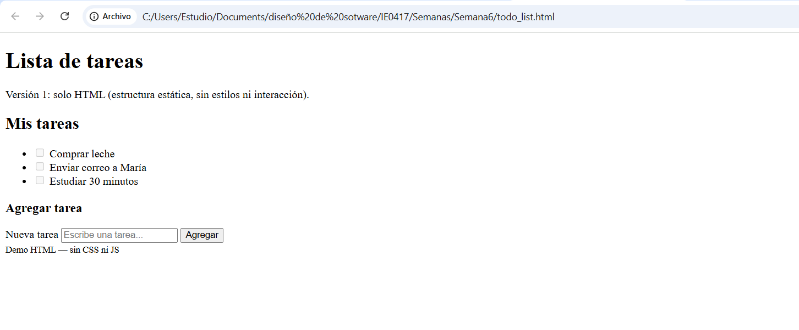
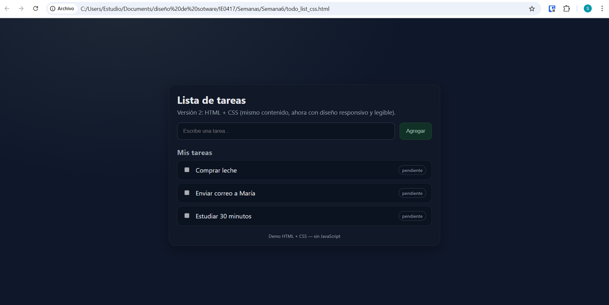
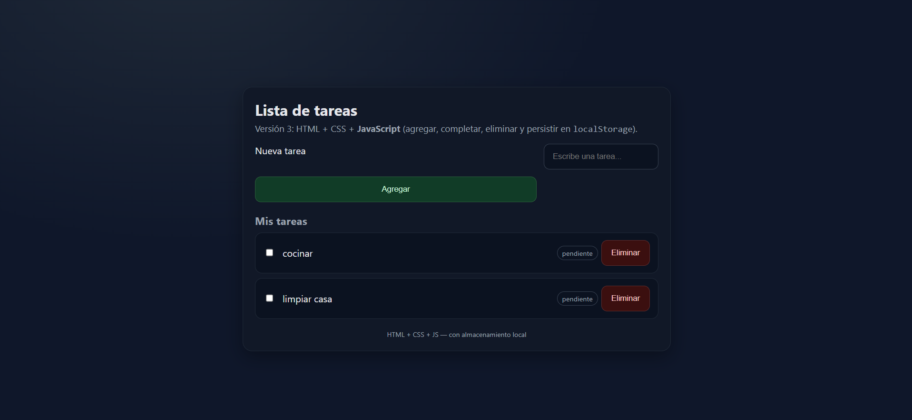

# Investigación sobre Frontend

## 1. Introducción al desarrollo web

### ¿Qué es el desarrollo web?
El desarrollo web engloba todos los procesos de creación y mantenimiento de sitios web y aplicaciones web que se ejecutan sobre Internet. Incluye tanto la parte visible al usuario (interfaz, diseño, interactividad) como la parte invisible (servidor, bases de datos, lógica de negocio) [1].

### Diferencia entre frontend y backend
- **Frontend** (lado del cliente): todo lo que ve y con lo que interactúa el usuario en su navegador. Incluye la interfaz visual, la experiencia de usuario, estilos, animaciones, manejo de eventos, etc.
- **Backend** (lado del servidor): todo lo que ocurre tras bambalinas para que la aplicación funcione correctamente: lógica de negocio, gestión de datos, base de datos, autenticación, seguridad, APIs, etc [1].  

#### ¿Por qué se divide en frontend y backend?
- Para separar responsabilidades: una parte se enfoca en qué ve/usa el usuario, la otra en cómo se procesan los datos, se almacenan, se ejecuta la lógica interna [2].   
- Permite optimizar distintos aspectos: la parte frontend optimiza experiencias visuales, interactivas, tiempos de respuesta perceptibles; el backend optimiza rendimiento, seguridad, fiabilidad de servidores, bases de datos.  

#### Evolución del desarrollo web
1. **Páginas estáticas (Web 1.0)**  
   - Sitios donde cada página era un archivo HTML con contenido fijo, imágenes, enlaces [3].  

2. **Páginas dinámicas / Web 2.0**  
   - Inclusión de lógica del servidor para generar páginas “al vuelo” según datos (base de datos, variables de usuario, etc.) [4].  

3. **Aplicaciones modernas**  
   - **SPA (Single Page Application):** la aplicación carga una vez y luego solo cambia contenido dinámicamente, sin recargar toda la página.
   - **PWA (Progressive Web App):** aplicaciones web que se comportan como apps nativas en algunos aspectos: capacidad offline, notificaciones push, carga rápida, seguridad, instalación.  

#### Roles de frontend y backend
- El **frontend** “presenta” la aplicación: interfaz gráfica, interacción del usuario, validaciones del lado cliente, respuesta inmediata visual.  
- El **backend** “sostiene” la aplicación: procesos intensivos, lógica de negocio, persistencia de datos, seguridad, autenticación/autorización, APIs, etc.  

---
## 2. Frontend

### Tecnologías base: HTML, CSS, JavaScript

### ¿Qué es HTML?

- HTML (HyperText Markup Language) es el lenguaje de marcado estándar para documentos diseñados para ser mostrados en un navegador web. Define la **estructura** del contenido: encabezados, párrafos, listas, enlaces, imágenes, etc [5].  
- HTML permite semántica: etiquetas que no solo organizan visualmente, sino que comunican el tipo de contenido (por ejemplo `<header>`, `<nav>`, `<article>`) lo que ayuda con accesibilidad, SEO, dispositivos de asistencia [6].  
- También permite incrustar contenido multimedia (audio, video), formularios, links a otras páginas o recursos [7]. 

### ¿Qué es CSS?

- CSS (Cascading Style Sheets) es un lenguaje de hojas de estilo usado para describir la **presentación** de un documento HTML o XML. Esto incluye colores, tipografía, diseño de cajas (márgenes, relleno), disposiciones visuales, estilos para distintos medios (pantalla, impresión, etc.) [8].  
- CSS permite separar contenido (HTML) de presentación (cómo se ve). Esa separación permite mantener mejor el código, reusar estilos, hacer temas visuales distintos y adaptar la apariencia sin cambiar la estructura [9].  
- También soporta animaciones, transiciones, transformaciones, layouts responsivos (flexbox, grid), estilos adaptativos a distintos dispositivos (uso de media queries) [10].   

### ¿Qué es JavaScript?

- JavaScript es un lenguaje de programación interpretado (o compilado just-in-time) ampliamente usado para proporcionar **dinamismo** e interactividad en páginas web [11].  
- Con JS puedes modificar el contenido del DOM (Document Object Model) logrando añadir, eliminar o cambiar objetos, responder a eventos de usuario (clicks, movimientos del mouse, entradas de formulario), validar datos, controlar multimedia, animaciones, llamadas a servidores sin recargar la página (fetch, AJAX), etc [12]. 
- JavaScript funciona en el navegador del usuario, aunque también puede ejecutarse en otros entornos (por ejemplo, Node.js) para lógica de backend, procesamiento, etc [13].  

---

### ¿Cómo se complementan HTML, CSS, JavaScript?

| Componente | Rol principal | Complemento con los demás |
|------------|----------------|-----------------------------|
| **HTML** | Estructura y contenido: define qué elementos hay, su jerarquía, su semántica. | Sin HTML no hay contenido que estilizar ni con qué interactuar. Es la base. |
| **CSS** | Presentación visual: hace que el contenido estructurado por HTML se vea bien, con estilos, diseño, estética. | Aplica estilos sobre la estructura dada por HTML. También reacciona al DOM (modificado por JS) para cambios visuales. |
| **JavaScript** | Comportamiento e interactividad: actualizaciones dinámicas, responder eventos, lógica de usuario, animaciones, modificaciones del contenido y del estilo en respuesta a acciones. | Usa HTML como punto de partida (DOM), manipula el DOM generado, puede cambiar estilos definidos en CSS, puede insertar clases, estilos inline, etc. También puede cargar contenido nuevo que HTML por sí solo no hubiese tenido. |

---

### Ejemplo conceptual

- Imagina una página de formulario de contacto:
  1. **HTML** define los campos: `<form>`, `<input>`, `<textarea>`, `<button>`, etiquetas `<label>`, etc.  
  2. **CSS** define cómo se ven esos campos: colores, bordes, espaciado, tipografía, disposición (por ejemplo dos columnas si la pantalla es grande, una columna si es móvil), estilo hover en botones, etc.  
  3. **JavaScript** añade validaciones: si el usuario deja un campo vacío, muestra mensaje de error, impide enviar hasta que esté bien, quizá envía los datos mediante AJAX para no recargar la página, muestra animaciones o feedback visual.

---

### Beneficios de usarlos juntos

- Mejora la **experiencia de usuario**: páginas que no solo muestran contenido, sino que se ven bien y responden a lo que el usuario hace.  
- Mantenimiento más fácil: separar lógica, estructura y presentación hace que cada parte se pueda modificar sin afectar demasiado a las otras.  
- Adaptabilidad: diferentes dispositivos, distintos tamaños de pantalla, diferentes medios (pantalla vs impresión) son más fáciles de soportar.  
- Optimización: carga inicial más rápida si CSS separado, HTML ligero; JS cargado asincrónicamente; mejoras en rendimiento visual.  

---
## Frameworks modernos: React, Angular, Vue

### Qué aportan respecto al JavaScript puro

- **Componentes reutilizables**: Permiten dividir la interfaz en piezas independientes que se pueden reutilizar en diferentes partes de la aplicación. Esto reduce duplicación de código y mejora mantenimiento. Por ejemplo, en React se crean componentes que encapsulan lógica, estilos y estructura [13].   
- **Virtual DOM / renderizado eficiente**: React y Vue utilizan Virtual DOM para minimizar manipulaciones costosas del DOM real, solo actualizar lo que cambia. Esto mejora el rendimiento en aplicaciones con interfaces dinámicas [14].   
- **Arquitectura y organización**: Los frameworks ofrecen formas estructuradas de organizar el código — separaciones de componentes, gestión de estado, routing, ciclo de vida, etc. Esto facilita escalar la aplicación, trabajar en equipo y mantener el código. JavaScript puro puede volverse desordenado si se hace todo manualmente [14].  
- **Herramientas adicionales y ecosistema**: Los frameworks vienen con (o suelen tener) herramientas para testing, compilación, optimización, integración con backends, soporte para renderizado del lado servidor o isomórfico, etc. Esa infraestructura facilita que se puedan construir aplicaciones más complejas de forma más segura y mantenible [15].  

---

### Ejemplos de sitios que los utilizan

Aquí algunos ejemplos de sitios/apps reales que usan React, Angular o Vue:

- **Vue.js**: Alibaba, Nintendo, Adobe’s Behance, GitLab, BMW.  
- **Angular**: Netflix, Google, Microsoft, Samsung, Tesla.  
- **React**: Varias grandes plataformas usan React en su interfaz principal o en partes de sus sitios (por ejemplo, Facebook lo mantiene). Además, React es muy usado en SPAs, dashboards y grandes aplicaciones web [12].  

---

### Comparación breve entre ellos

| Característica            | React                                   | Angular                                 | Vue.js                                |
|----------------------------|------------------------------------------|-------------------------------------------|-----------------------------------------|
| Origen / Apoyo             | Creado por Facebook, comunidad muy activa | Desarrollado por Google, framework completo | Creado por Evan You y comunidad amplia |
| Filosofía / enfoque        | Librería-UI basada en componentes, Virtual DOM, foco en la vista       | Framework completo “todo-incluido”, con muchas funcionalidades integradas (routing, inyección de dependencias, etc.) | Framework progresivo, modular, fácil de integrar en proyectos existentes |
| Curva de aprendizaje       | Moderada. JSX, manejo del estado, ecosistema [12].           | Más pronunciada; muchas funcionalidades; estructura más rígida [13].             | Más suave; buena para empezar; sintaxis más simple comparativa [13].             |
| Rendimiento                | Muy buen rendimiento cuando se usan bien las optimizaciones; virtual DOM ayuda a minimizar actualizaciones innecesarias [14].      | Excelente en aplicaciones grandes si se usa bien, pero puede generar tamaños de bundle grandes y requerir optimización [15].          | Ligero, rápido, buen rendimiento; Vue 3 mejora muchas cosas y permite adoptar progresivamente [15].            |
| Flexibilidad / modularidad | Alta; puedes usar solo lo que necesitas del ecosistema.             | Menos flexible en algunos aspectos; muchas decisiones ya hechas por defecto.         | Muy flexible; puedes ir añadiendo partes de Vue según se necesite.              |
| Casos ideales              | SPAs, dashboards, apps con muchas interacciones y componentes reutilizables | Aplicaciones corporativas grandes, donde se requiere estructura, escalabilidad, equipo grande | Proyectos nuevos medianos, experimentos, apps donde se quiere equilibrio entre simplicidad y funcionalidad |

---

## 3. Actividad sugerida: Comparacion de tecnologias
### Aplicacion de Lista QueHacer (Todo List) implementando las tecnologias:

- **Figura 1:** App de Lista QueHacer solo con HTML

- **Figura 2:** App de Lista QueHacer con HTML-CSS

- **Figura 3:** App de Lista QueHacer con HTML-CSS-Javascript

---

## Referencias

[1] Owius, “Diferencias entre desarrolladores web frontend y backend: guía,” [En línea]. Disponible: https://owius.com/diferencias-entre-desarrolladores-web-frontend-y-backend-guia/

[2] Kinsta, “Backend vs Frontend: Diferencias clave,” [En línea]. Disponible: https://kinsta.com/es/blog/backend-vs-frontend/

[3] Wix, “La evolución de la web: de Web 1.0 a Web 3.0,” [En línea]. Disponible: https://es.wix.com/blog/evolucion-de-la-web

[4] CIS Informática, “Evolución de las páginas web,” [En línea]. Disponible: https://www.cisinformatica.cat/es/evolucion-de-las-paginas-web/

[5] Mozilla Developer Network, "What is HTML? Creating the content," *MDN Web Docs*, 24-Jun-2025. [En línea]. Disponible: https://developer.mozilla.org/en-US/docs/Learn/web_development/Getting_started/Your_first_website/Creating_the_content

[6] Mozilla Developer Network, "CSS: Styling the content," *MDN Web Docs*. [En línea]. Disponible: https://developer.mozilla.org/en-US/docs/Learn/web_development/Core/Styling_basics/What_is_CSS

[7] Mozilla Developer Network, "What is JavaScript?," *MDN Web Docs*. [En línea]. Disponible: https://developer.mozilla.org/en-US/docs/Learn/web_development/Core/Scripting/What_is_JavaScript

[8] Tadabase, "HTML, CSS, & JavaScript Explained with Analogies," *Tadabase Blog*, 12-Nov-2024. [En línea]. Disponible: https://tadabase.io/blog/html-css-javascript-explained

[9] Wikipedia, "CSS," [En línea]. Disponible: https://es.wikipedia.org/wiki/CSS

[10] Wikipedia, "HTML," Living Standard, WHATWG. [En línea]. Disponible: https://html.spec.whatwg.org/

[11] Asynclabs, “Vanilla JavaScript vs React: Choosing the Right Tool for Web Development,” 5-Sep-2023. [En línea]. Disponible: https://www.asynclabs.co/blog/software-development/vanilla-javascript-vs-react-choosing-the-right-tool-for-web-development

[12] Pulsion, “React vs. JavaScript: Which Framework Suits Your Mobile ...,” 10-Jul-2024. [En línea]. Disponible: https://www.pulsion.co.uk/blog/react-vs-javascript/

[13] Monterail, “Top 15 Inspiring Companies Using Vue.js in 2024,” 13-Dec-2024. [En línea]. Disponible: https://www.monterail.com/blog/top-companies-using-vue-js

[14] Trio.dev, “Top 15 Real-World Websites Using Vue.js in 2025,” 2-May-2025. [En línea]. Disponible: https://trio.dev/websites-using-vue/

[15] Pangea.ai, “Biggest Companies Keeping Angular Popular,” 18-Nov-2024. [En línea]. Disponible: https://pangea.ai/resources/biggest-companies-keeping-angular-popular

[16] Computools, “Examples of Global Websites Using Vue.js,” [En línea]. Disponible: https://computools.com/global-websites-using-vue-js
