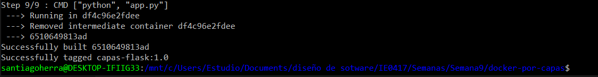
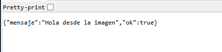
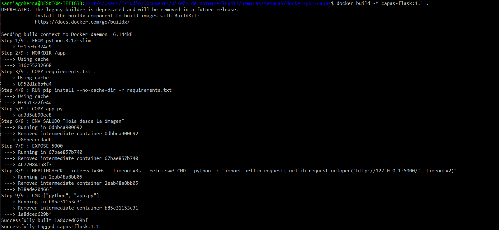
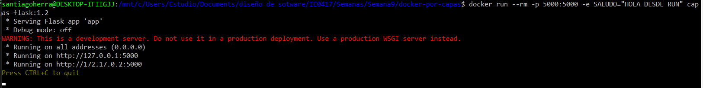
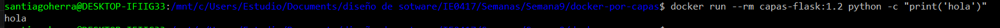
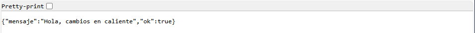

# Laboratorio Docker: de cero a capas (con Flask)

**Universidad de Costa Rica – Escuela de Ingeniería Eléctrica**  
**Curso:** IE0417 – Diseño de Software para Ingeniería  
**Docente:** Rafael Esteban Badilla Alvarado  
**Estudiante:** Santiago Herra Castro  

---

## Objetivos del laboratorio

- Entender la diferencia entre **imagen** y **contenedor**.  
- Observar cómo funcionan las **capas de una imagen Docker** y cómo el **caché** acelera los builds.  
- Construir una imagen por capas con un **Dockerfile bien estructurado**.  
- Controlar el contexto del build con **.dockerignore**.  
- Ejecutar contenedores, exponer puertos, pasar variables de entorno y montar volúmenes.  
- Diferenciar entre **CMD** y **ENTRYPOINT**.  
- Añadir un **HEALTHCHECK**.  
- Usar **Docker Compose** y crear un ejemplo **multi-stage**.

---

## Prerrequisitos

- Docker y Docker Compose instalados.  
  ```bash
  docker --version
  docker compose version
  Editor de texto (VS Code, nano, etc.)
  curl instalado para probar endpoints.

📁 Estructura del proyecto
docker-por-capas/
  ├── app.py
  ├── requirements.txt
  ├── Dockerfile
  ├── Dockerfile.dev
  ├── .dockerignore
  ├── compose.yaml
  └── Figuras

## 1. Construcción de la imagen

El siguiente paso es construir una imagen base con Python y Flask.

```bash
docker build -t capas-flask:1.0 .
```

**Qué hace:**
- `docker build`: crea una imagen Docker a partir de un archivo `Dockerfile`.
- `-t capas-flask:1.0`: asigna el nombre y etiqueta (tag) `capas-flask:1.0`.
- `.`: indica que el contexto de construcción se encuentra en el directorio actual.

**Efecto:** Docker lee el archivo `Dockerfile`, ejecuta cada instrucción y genera una imagen que servirá como plantilla para los contenedores.



---

## 2. Ejecución del contenedor

Una vez creada la imagen, se ejecuta un contenedor basado en ella.

```bash
docker run --name demo-capas -d -p 5000:5000 capas-flask:1.0
```

**Qué hace:**
- `docker run`: crea y ejecuta un contenedor a partir de una imagen.
- `--name demo-capas`: asigna un nombre al contenedor.
- `-d`: ejecuta el contenedor en segundo plano (modo “detached”).
- `-p 5000:5000`: mapea el puerto 5000 del host al puerto 5000 del contenedor.

**Efecto:** se levanta un servidor Flask accesible en `http://localhost:5000`.

Para verificar el funcionamiento:
```bash
curl http://localhost:5000
```

**Efecto:** muestra la respuesta JSON de la aplicación Flask dentro del contenedor.




---

## 3. Agregar un HEALTHCHECK

En el `Dockerfile` se define un comando que permite verificar la salud del contenedor.

```dockerfile
HEALTHCHECK --interval=30s --timeout=3s --retries=3 CMD \
  python -c "import urllib.request; urllib.request.urlopen('http://127.0.0.1:5000/', timeout=2)"
```

**Qué hace:**
- `HEALTHCHECK`: indica a Docker cómo verificar si el contenedor está funcionando correctamente.
- `--interval=30s`: ejecuta la verificación cada 30 segundos.
- `--timeout=3s`: espera hasta 3 segundos por respuesta.
- `--retries=3`: marca el contenedor como no saludable si falla 3 veces seguidas.

**Efecto:** permite que Docker monitoree el estado del servicio Flask.

Comando para revisar el estado:
```bash
docker inspect demo-capas --format '{{.State.Health.Status}}'
```


---

## 4. Demostración del caché de capas

Al modificar un archivo y volver a construir la imagen:

```bash
docker build -t capas-flask:1.1 .
```

**Qué hace:**
- Docker reutiliza las capas previas que no cambiaron (aparecen como `CACHED`).

**Efecto:** el proceso de construcción es mucho más rápido, ya que solo se reconstruyen las capas modificadas.



---

## 5. Uso de variables de entorno

Se puede personalizar el comportamiento del contenedor mediante variables de entorno.

```bash
docker run --rm -p 5001:5000 -e SALUDO="Hola desde ejecución" capas-flask:1.1
```

**Qué hace:**
- `-e SALUDO=...`: define una variable de entorno dentro del contenedor.

**Efecto:** la aplicación Flask toma el valor de la variable y muestra un mensaje distinto.

También se puede usar un archivo `.env`:
```bash
docker run --rm -p 5002:5000 --env-file .env capas-flask:1.1
```



---

## 6. CMD vs ENTRYPOINT

Las instrucciones `CMD` y `ENTRYPOINT` definen el comando principal de un contenedor.

**CMD:** se puede sobrescribir al ejecutar el contenedor.
```dockerfile
CMD ["python", "app.py"]
```

**ENTRYPOINT:** siempre se ejecuta, y los argumentos se añaden al final.
```dockerfile
ENTRYPOINT ["python", "app.py"]
```

**Efecto:** CMD permite flexibilidad; ENTRYPOINT garantiza un punto de entrada fijo.



---

## 7. Montaje de volúmenes para desarrollo

El siguiente comando crea un contenedor que refleja los cambios del código en tiempo real.

```bash
docker run --name dev-capas -d -p 5000:5000 -v "$PWD":/app capas-flask:dev
```

**Qué hace:**
- `-v "$PWD":/app`: monta el directorio actual del host dentro del contenedor.

**Efecto:** los cambios en `app.py` se reflejan automáticamente sin reconstruir la imagen.



---

## 8. Uso de Docker Compose

`compose.yaml` permite automatizar la construcción y ejecución de los servicios.

```bash
docker compose up -d
```

**Qué hace:**
- `docker compose up`: construye y ejecuta los servicios definidos en el archivo Compose.
- `-d`: ejecuta en segundo plano.

**Efecto:** con un solo comando se levantan la imagen, los contenedores y las configuraciones.

Para detener todo:
```bash
docker compose down
```

**Efecto:** elimina los contenedores y libera los recursos asociados.


---

## 9. Multi-stage Build

Permite separar la etapa de construcción de la etapa de ejecución.

```bash
docker build -t capas-flask:multistage .
```

**Qué hace:**
- Ejecuta las etapas definidas en el Dockerfile (por ejemplo `AS build` y `AS runtime`).

**Efecto:** reduce el tamaño final de la imagen y mejora la eficiencia.

---

## 10. Limpieza del entorno

Al finalizar, se eliminan contenedores e imágenes no utilizadas para liberar espacio.

```bash
docker stop $(docker ps -aq)
docker rm $(docker ps -aq)
docker image prune -f
docker system prune -f
```

**Qué hace:**
- `docker stop`: detiene todos los contenedores activos.
- `docker rm`: elimina los contenedores detenidos.
- `docker image prune`: borra imágenes sin usar.
- `docker system prune`: limpia cachés y redes temporales.

**Efecto:** el sistema Docker queda limpio y optimizado para nuevos laboratorios.

